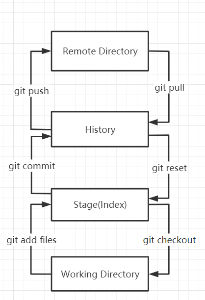

# Git

## 版本控制

`版本控制`(Revision control)是一种在开发过程中用户管理对文件，目录或工程等内容的修改历史，方便查看更改历史记录，备份以便恢复以前的版本的软件工程技术

## Git与SVN的区别

`SVN`是集中式版本控制器，版本库是集中放在中央服务器的；工作时，需要从中央服务器得到最新的版本；工作完成后，需要把工作内容推送到中央服务器。需要联网

`Git`是分布式版本控制系统，没有中央服务器，每个电脑都是一个完整的版本库，不需要联网。

==Git是世界上最先进的分布式版本控制系统。==

## Git安装

**Git Bash**:Unix和Linux风格的命令行，使用最多，推荐

**Git CMD**: Windows风格的命令行

**Git GUI** : 图形界面的Git，不建议初学者使用

## 基本的Linux命令

- `cd`：改变目录
- `cd ..`回退到上一个目录，直接cd进入默认目录
- `pwd`显示当前所在的目录路径
- `ls(ll)`/`ls`都是列出当前目录中的文件，(ll)列出的内容更为详细
- `touch`新建一个文件
- `rm`删除一个文件
- `mkdir`新建一个目录（新建一个文件夹）
- `rm -r`删除一个文件夹，rm -r src 删除src目录
- `mv`移动文件，mv index.html src ;index.html是我们要移动的文件；src是目标文件夹
- `clear`清屏
- `reset`重新初始化终端/清屏
- `history`查看历史命令
- `help`帮助
- `exit`退出
- `#`注释

## Git配置

查看配置`git config -l`

查看不同级别的配置文件：

```bash
#查看系统config
git config --system --list
#查看当前用户(global)用户
git config --global --list
```

系统配置文件D:\devSoftware\Git\etc

添加name和email


## Git基本理论

`Workspace`工作区，用来存放代码的地方

`Index/Stage`暂存区，用户存放临时改动，事实上是一个文件，保存即将提交到文件列表的信息

`Repository`仓库区（或本地仓库），存放数据的位置，里面有提交的所有版本的数据。其中Head指向最新放入仓库的版本

`Remote`：远程仓库，托管代码的服务器



## Git项目搭建

> 本地仓库搭建

创建本地仓库的方法有两种：一种是创建全新的仓库，另一种是克隆远程仓库

1.创建本地仓库

```bash
git init
```

2.克隆远程仓库

```bash
git clone url
```

## Git文件操作

> 文件4种状态

版本控制就是对文件的版本控制，要对文件进行修改，提交等操作，首先要知道文件当前处于什么状态，否则会出现提交了现在还不 想提交的文件，或者要提交的文件没有提交上。

`Untracked`未跟踪，此文件在文件夹种，但并没有加入到git库中，不参与版本控制，通过`git add`状态变为`Staged`

`Unmodify`文件已经入库，未修改，即版本库中的文件快照内容与文件夹中完全一致，这种类型的文件有两种去处，如果它被修改，则变为`Modified`,如果使用`git rm`移出版本库，则成为`Untracked`文件

`Modified`文件已修改，没有进行其他操作；通过`git add `可进入暂存`staged`状态，使用`git checked`则丢弃修改，返回到`Unmodify`状态，`git checked`即从库中取出文件，覆盖当前修改

`Staged`暂存状态，执行`git commit`则将修改同步到库中，这时库中的文件和本地文件又变为一致，文件为`Unmodify`状态，执行`git reset HEAD filename`取消暂存，文件状态为`Modified`

> 查看文件状态

```bash
#查看指定文件状态
git status [filename]

#查看所有文件状态
git status

#添加所有文件到暂存区
git add .

#提交暂存区内容到本地仓库 -m 信息
git commit -m
```

> 忽略文件

在主目录下建立`.gitignore`文件

```bash
#为注释
*.txt		#忽略所有 .txt结尾的文件，上传时不会选中
!lib.txt          #但lib.txt除外
/temp 	     #仅忽略项目根目录下的TODO文件，不包括其他目录temp
build/          #或略build/目录下的所有文件
doc/*.txt     #会忽略 doc/notes.txt  但不包括 doc/server/arch.txt
```

## 使用码云

> 添加SSH公钥


> 使用码云创建一个自己的仓库

## IDEA集成Git
    
- 新建项目
- 绑定git

把远程仓库复制拷贝到项目目录中

> 修改文件，使用IDEA操作git

- 添加到暂存区
- commit提交
- push到远程仓库

## Git分支

master主分支应该非常稳定，用来发布新版本，一般情况下不允许在上面工作，工作一般情况下在新建的dev分支上工作，工作完成后需要发布时，可以合并到主分支master上

```bash
#列出所有本地分支
git branch

#列出所有远程分支
git branch -r

#新建一个分支，但停留在本分支
git branch [branch-name]
#新建一个分支，并切换到分支
git checkout -b [branch]
#合并指定分支到当前分支
git merge [branch]
#删除分支
git branch -d [branch-name]
#删除远程分支
git push origin --delete [branch-name]
git branch -dr [remote/branch]
```
## 从远程仓库获取最新代码合并到本地分支
### git pull:获取最新代码到本地，并自动合并到当前分支

```bash
//查询当前远程的版本
$ git remote -v
//直接拉取并合并最新代码
$ git pull origin master [示例1：拉取远端origin/master分支并合并到当前分支]
$ git pull origin dev [示例2：拉取远端origin/dev分支并合并到当前分支]
```
不推荐方式，因为直接合并，无法提前处理冲突
### git fetch + git merge获取
```bash
//查询当前远程的版本
$ git remote -v
//获取最新代码到本地(本地当前分支为[branch]，获取的远端的分支为[origin/branch])
$ git fetch origin master  [示例1：从名为origin的远程上拉取名为master的分支到本地origin/master分支上]
$ git fetch origin dev [示例2：获取远端的origin/dev分支]
//查看版本差异
$ git log -p master..origin/master [示例1：查看本地master与远端origin/master的版本差异]
$ git log -p dev..origin/dev   [示例2：查看本地dev与远端origin/dev的版本差异]
//合并最新代码到本地分支
$ git merge origin/master  [示例1：合并远端分支origin/master到当前分支]
$ git merge origin/dev [示例2：合并远端分支origin/dev到当前分支]
```
## git push
```bash
git push [远程主机名] [本地分支名]:[远程分支名]
```
如果本地分支名和远程分支名相同，则可以省略冒号
```bash
git push [远程主机名] [本地分支名]
```
## git fetch 和git pull的区别
`git pull`会将本地库更新至远程库的最新状态，`git pull`是`git fetch`与`git merge`的组合
如果想比较，本地分支和线上分支的差别，可以先`git fetch`，这样就可以用`git diff origin/xxx`,进行比较了。
如果一切都正常了，可以合并:`git merge`
## 回退操作
`git reset head`在master分支上回退，如果在一个新的分支，就会出现unstaged changes after reset
解决办法：
1.git add .
git reset --hard
2.git stash
git stash drop
  