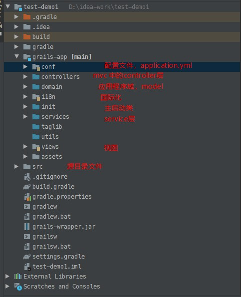

# Grails框架
基于Groovy语言开发的框架
## 框架搭建(IDEA)
- new Project->Grails
- 配置gradle
- 运行项目
  - 方式一：通过Application运行，打开grails-app/init/Application,运行main方法
  - 方式二：配置grails(类似配置tomcat)

## 框架的基本结构
约定大于配置


## 配置数据库
以mysql为例,由于grails框架的yml文件中默认有三个运行环境,development,test,production,以下为datasource总配置
```yml
dataSource:
    pooled: true
    jmxExport: true
#    url: jdbc:mysql://localhost:3306/db_01?useUnicode=ture&characterEncoding=utf-8
    driverClassName: com.mysql.jdbc.Driver
    username: root
    password: xhh1999.02.10
```
分配置，以development开发环境为例
```yml
environments:
    development:
        dataSource:
            dbCreate: create-drop
            url: jdbc:mysql://localhost:3306/db_01?useUnicode=true&characterEncoding=utf-8
```
- dbCreate
  - create-drop：每次重启都会清空历史数据，开发环境使用
  - update：更新数据库
  - none：对数据库不进行任何操作
  - validate：验证

## 新建domain实体类
- 新建Book类，写入字段
-   约束属性
    -   blank和nullable的区别
        -   blank用于约束string，nullable用于约束对象
        -   blank允许空字符串，nullalble允许null
```java
static constraints={
    name(blank: false,nullable: false)
    ...
}
```
- mapping(映射数据库字段)

```java
static mapping={
    table 'book'
    id column:'id'
}
```
- 不生成对应的表结构

定义domain内部类

- 生成表，不生成某些字段的表结构

```java
//static transients = ['myfield']  定义时只需要指定这个static transients 即可

class A {
String name

static transients = ["name"]

int age

}
```
这样在数据库中只会生成age字段

- 去除乐观锁的影响

grails的domain会自动添加乐观锁，即每个表记录都有一个version字段
```java
static mapping = {
    version false
}
```
- 表已经存在，并且与domain不对应

grails domain与表结构是默认按照驼峰命名法对应的，即实体类CustomerUser对应customer_user，字段PhoneNumber对应phone_number
```java
    static mapping = {
        table('phone') //表
        phoneView column : 'phone' //字段
}
```
### domain生成controller
domain创建实体类，可以手动选择创建controller和service,类中定义了一些操作数据库的方法（增删改查）
### grails框架find,get,list
查找所有域类实例：
```java
Book.findAll()
Book.getAll()
Book.list()
```
检索指定id的域类的实例
```java
Book.findById(1)
Book.get(1)
```
- getAll是get的增强版，它带有多个id并且返回List实例。列表大小与提供的id数相同;没有则返回空列表项
- get按id查找单个实例，它使用缓存。如果在二级缓存中调用过则会一直使用缓存查询
- findAll允许使用HQL查询并支持分页
- findBy..是动态查找器，不使用类的实例缓存，但是如果开启了查询缓存，则可以缓存.findBy更加智能
- list查找所有实例并支持分页
##  Controller类
controller默认映射路径为`localhost:8080/controller类前缀名/方法名`
> 作用域

- servletContext,称为application作用域，允许在整个web应用程序中共享状态
- session,允许关联某个给定用户的状态，通常使用Cookie把一个session与用户进行关联
- request,只允许存储当前的请求对象
- params,可变的请求参数map，获取传递的参数

### 呈现视图,render,redirect,repond的区别

- render
  - 界面跳转(url不变)，向网页输出数据，render之后程序会继续执行，但是后面不能使用redirect,respond(控制台报错)
    - text-要呈现的文本数据
    - builder-渲染标记时使用的构造器
    - view-渲染的视图位置，当需要跳转到其他controller页面时显示
    - template-要呈现的模板。模板通常是一个HTML文本
    - layout-用于响应的布局
    - var-要传递给模板的变量的名称，如果未指定，则默认为Groovy的默认参数it
    - bean-在渲染中使用的bean
    - model-用于渲染的模型，返回json类型数据
    - collection-用于针对集合中的每个项目呈现模板
    - contentType-响应格式
    - encoding-响应编码
    - plugin-在其中查找模板的插件
    - status-要使用的http状态编码
    - file-与响应一起发送的byte[],java.io.File或者inputStream
    - fileName-用于渲染文件时指定文件名
  - render不在最后一行返回后面需要添加return    
- redirect
  - 重定向，url发生改变。redirect之后，程序继续执行，后面不能再次使用redirect，虽然可以使用render,respond但是没有任何作用
- respond
  - 向页面返回数据。respond之后，程序会继续执行，后面可以使用render,redirect,但是respond没有作用

### render和respond区别
respond命令和render命令相比，主要是能自动根据Accept header选择输出格式
render类似与printWriter()
```groovy
    def list() {
        def books = Book.list()

        withFormat {
            html bookList: books
            json { render books as JSON }
            xml { render books as XML }
        }
    }
    //顺序会影响输出内容
```
使用==respond==，可以简化成：
```groovy
    def list() {
        respond Book.list(),formats:['json','html','xml']
    }
    //顺序会影响输出内容
```
在view里访问Model时，会把Book.list()自动解析成为bookList 
### URL Mapping
```groovy
class UrlMappings {
    static mappings = { 
    }
}
```
- 基本URL配置
```groovy
“/student”(controller:”student”, action:”list”)
```
当访问`...../student`时会转向StudentController中的list方法 
- 映射到view

```groovy
static mappings = {
    "/"(view:"/index") //映射到根目录下的index.jsp
}

static mappings = {
    "/aboutus"(controller: "site",view:"aboutUs") //映射到controller下的某个视图
}
```
- 设置controller默认action

```groovy
static defaultAction = “list”
```
- 带参数URL

```groovy
static mappings = {
    "/student/$name"(controller:"student")
}
```
`$name`,grails会将URL中的$name位置的内容当成参数放在params中
多个参数
```groovy

static mappings = {
 
“/$year/$month?/$day?”(controller:”student”, action:”list”)
```
- 映射到不同的HTTP请求

```groovy
'/test/httpmethod'{
    controller = 'testUrlMapping'
    action=[GET:'getAction',POST:'postAction']
}
```
- 通配符的使用

```groovy
static mappings = {
    "/site/*.html"(controller:"html1") //1
    "/site/$name.html"(controller:"html2")//2
    "/site/**.html"(controller:"html3")//3
    "/site/$name**.html"(controller:"html4")//4
}
```
这里配置的1和2都会将类似的/site/ex.html转发到指定的controller中，不同的是我们可以在2的controller中通过params.name获取参数。3和4中是两级通配符，类似/site/eeee/ex.html的URL都会转发到controller中