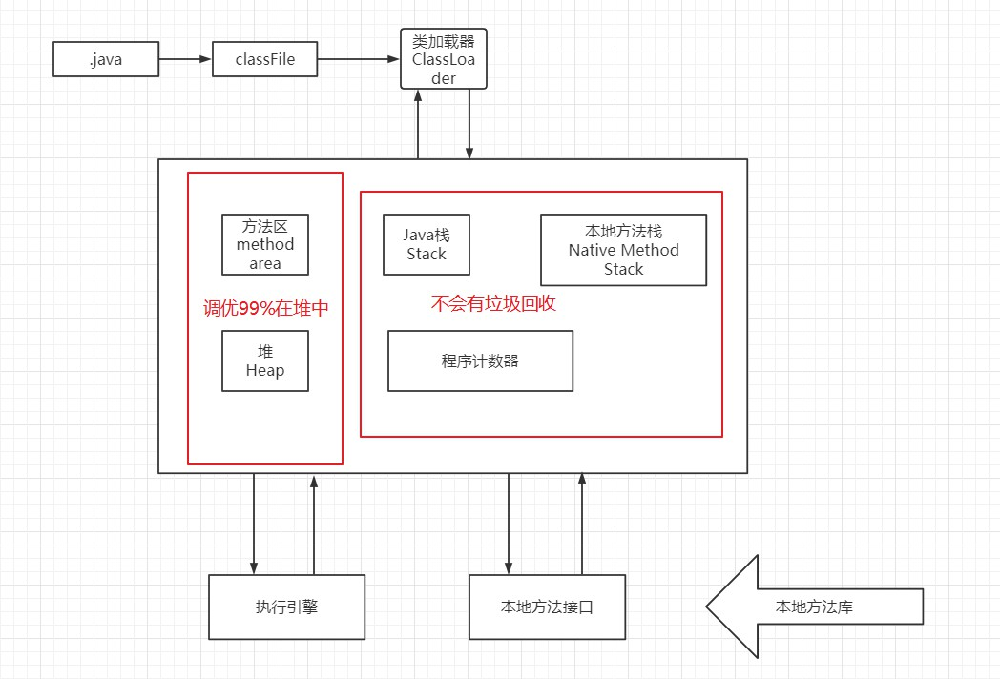
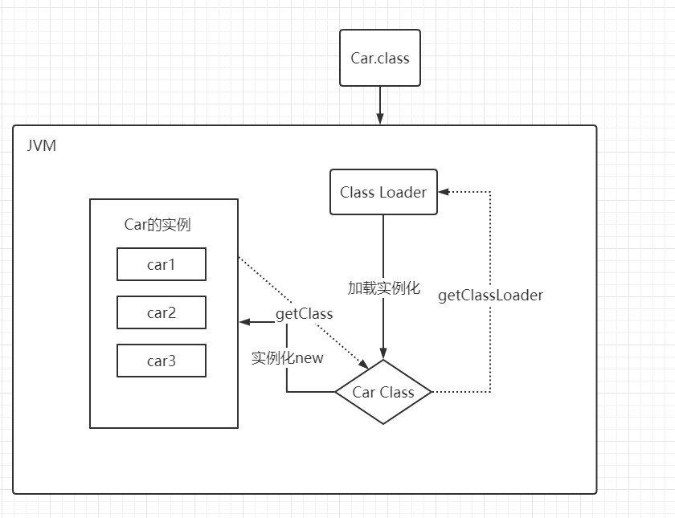
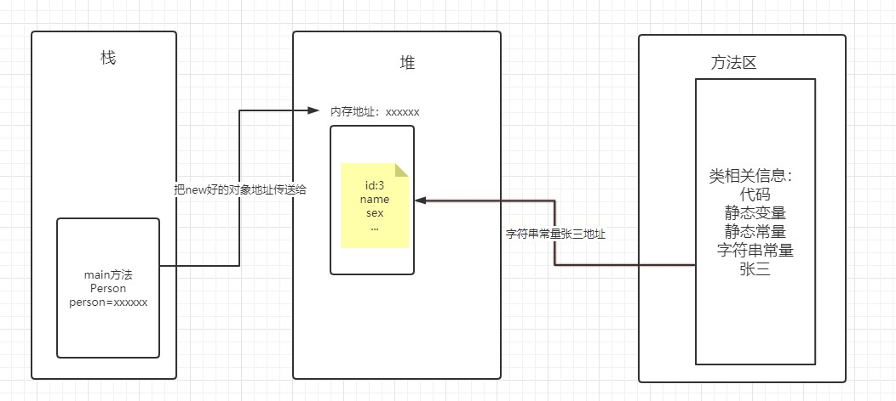

# JVM基础知识
## JVM结构

## 类加载器
作用：加载class文件

JVM中提供了三层的ClassLoader:

- `BootStrap classLoader`:主要负责加载核心的类库(例如java.lang.*)，构造ExtClassLoader和APPClassLoader
- `ExtClassLoader`：主要负责加载jre/lib/ext目录下的一些拓展的jar
- `APPClassLoader`：主要负责加载应用程序的主函数类

## 双亲委派机制
使用双亲委派机制能够确保安全，防止危险代码的植入

当一个Hello.class文件被加载时。不考虑自定义类加载器，首先会在AppClassLoader中检查是否加载过，没有则一直往上查询。直到BootStrapClassLoader，已经没有父加载器了，这时考虑自己能否加载，如果自己无法加载，则下沉到子加载器中去加载，一直到最底层，如果没有任何加载器能够加载，则会报ClassNotFound异常

## 沙箱安全机制
组成沙箱的基本组件：
- 字节码校验器：确保Java类文件遵循Java语言规范。这样可以帮助Java程序实现内存保护。但并不是所有的类文件都会经过字节码校验器，比如核心类。
- 类加载器：
  - 它防止恶意代码去干涉善意代码（双亲委派机制）
  - 它守护了被信任的库边界
  - 它将代码归入保护域，确定了代码可以进行哪些操作

## Native
`native`：native关键字修饰的方法，表明Java的作用范围不能达到，会调用本地c/c++方法
- 进入本地方法栈
- 调用本地方法接口JNI(JNI的作用是扩展java的使用，融合不同的编程语言为java提供服务)

## PC寄存器
程序计数器：每个线程都有一个程序计数器，是线程私有的，就是一个指针，指向方法区中的字节码（用来存储指向指令的地址），是一个非常小的内存空间，几乎可以忽略不计
## 方法区
`method area`：方法区
方法区被所有线程共享，所有字段和方法字节码，以及一些特殊方法，比如构造方法，接口代码也在此定义，简单说，所有定义的方法的信息都保存在该区域，**此区域属于共享区间**
==静态变量，常量，类信息（构造方法，接口定义），运行时的常量池存在方法区中，但是实例变量存储在堆内存中，和方法区无关==
## 栈
程序：数据结构+算法
栈：栈内存，主管程序的运行，生命周期和线程同步；线程结束，栈内存释放，==不存在垃圾回收问题==


## 堆
Heap,一个JVM只有一个堆内存，堆内存的大小是可以调节的
堆内存中细分为三个区域：
- 新生区
  - 新生区分为伊甸园区，幸存区1(from),幸存区2(to)
- 养老区
- 永久区
  - 这个区域常驻内存。用来存放jdk自身携带的Class对象，Interface元数据，储存的是Java运行时的一些环境和类信息。这个区域不存在垃圾回收
  - jdk1.6之前：永久代，常量池在方法区
  - jdk1.7之前，永久区，但是慢慢退化了，去永久代，常量池在堆中
  - jdk1,8之后，无永久代，改为元空间

GC垃圾回收，主要在新生区和养老区
```java
    public static void main(String[] args) {
        //返回虚拟机试图使用的最大内存
        long l = Runtime.getRuntime().maxMemory();
        //返回JVM的最大内存
        long totalMemory = Runtime.getRuntime().totalMemory();
        System.out.println("max="+l+"字节\t"+l/1024/1024+"MB");
        System.out.println("total="+totalMemory+"字节\t"+totalMemory/1024/1024+"MB");
    }
```
```java
max=3795845120字节	3620MB
total=257425408字节	245MB
```
结论：默认情况下分配的总内存是电脑内存的1/4,初始化内存为1/64
`-Xms1024m -Xmx1024m -XX:+PrintGCDetails`：修改vm中内存的最大内存和总内存，并且打印GC信息
`-Xms`：设置初始化内存分配大小，默认1/64
`-Xmx`：设置最大分配内存，默认1/4
`-XX:+PrintGCDetails`：打印GC信息

## GC
GC两种：轻GC(普通GC)和重GC(FULL GC)
算法：标记清除法，标记压缩，复制算法，引用计数器
复制算法：

复制算法最佳使用场景：对象存活率较低时
总结：
- 内存效率：复制算法>标记清除算法>标记压缩算法(时间复杂度)
- 内存整齐度：复制算法=标记压缩算法>标记清除算法
- 内存利用率：标记压缩法=标记清除算法>复制算法