# JavaWeb

## 1.基本概念

web开发：

- web：网页
- 静态web
  - html,css
  - 提供所有人看的数据，始终不会发生变化
- 动态web
  - 数据发生变化，每个人在不同时间，不同地点看到的信息各不相同
  - 几乎所有网站
  - 技术栈：Servlet/JSP, ASP, PHP 

在Java中，动态web资源开发的技术统称为JavaWeb

### 1.1 web应用程序

web应用程序：可以提供浏览器访问的程序

- a.html , b.html ...... 多个web资源，这些web资源可以被外界访问，对外界提供服务
- 这个统一的web资源会被放在同一个文件夹下，web应用程序-->Tomcat:服务器
- 一个web应用由多个部分组成（静态web,动态web）
	 	html,css,js
	 	jsp,servlet
	 	java程序
	 	jar包
	 	配置文件(Properties)

web应用程序编写完毕后，若想提供给外界访问，需要一个服务器来统一管理
###1.2 静态web

- *.html , *.htm ,这些都是网页的后缀，如果服务器上一直存在这些东西，可以直接进行访问。

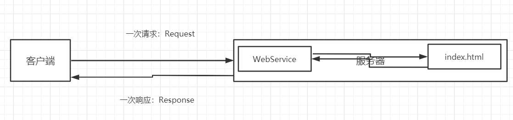

- 静态web存在的缺点
  - web页面无法动态更新，所有用户看到同一个页面
    - 轮播图，点击特效：伪动态
    - JavaScript(使用最多)
    - VBScript
  - 它无法和数据库交互（数据无法持久化，用户无法交互）

### 1.3动态web

页面会动态展示：“web的页面展示的效果，每个人都不同”

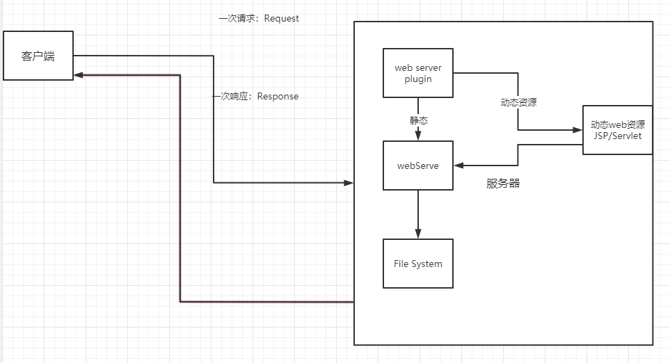

缺点

- 加入服务器的动态web资源出现了错误，需要重新编写**后台程序**
- 停机维护

优点

- web页面动态更新
- 可以和数据库交互（数据持久化：注册，用户信息）

## 2.web服务器

### 2.1web服务器

服务器是一种被动的操作，用来处理用户的一些请求和给用户一些响应信息

**IIS**

微软提供；ASP...,Windows自带

**Tomcat**

免费                                                                                                                                   

> 文件夹信息

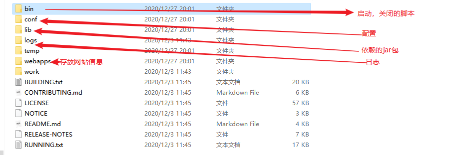

### 2.2配置

可以配置启动的端口号

- 默认端口号为8080
- mysql:3306
- http:80
- https:443

```xml
    <Connector port="8080" protocol="HTTP/1.1"
               connectionTimeout="20000"
               redirectPort="8443" />
```

可以配置主机的名称

- 默认的主机名为：localhost->127.0.0.1

```xml
      <Host name="www.xhh.com"  appBase="webapps"
            unpackWARs="true" autoDeploy="true">
```

- 修改C:\Windows\System32\drivers\etc下的hosts文件

```xml
127.0.0.1	www.xhh.com
```

### 2.3发布网站

网站应该有的结构

```java
--webapps : Tomcat服务器的web目录
    -ROOT
    -study: 网站的目录名
        -WEB-INF
        	-classes :java 程序
                -lib : web应用所依赖的jar包
                 -web.xml ： 网站配置文件
        -index.html 默认的首页
        -static
                  -css
                    -style.css
                   -js
                   -img
```

## 3.HTTP

### 3.1什么是http

HTTP(超文本传输协议 )是一个简单的请求-响应协议，它通常运行在TCP之上

### 3.2HTTP请求

- 客户端-请求-服务器

- > 使用baidu为例

```java
Request URL: https://www.baidu.com/   请求地址
Request Method: GET					请求方法get/post
Status Code: 200 OK					状态码：200
Remote Address: 36.152.44.95:443		
Referrer Policy: strict-origin-when-cross-origin
```

### 3.3HTTP响应

- 服务器-响应-客户端

```java
Cache-Control: private		缓存控制
Connection: keep-alive		连接
Content-Encoding: gzip		编码
Content-Type: text/html;charset=utf-8 类型
```

#### 响应状态码

200：请求成功

3**：请求重定向

- 重定向：重新跳转到指定的新位置

4**：找不到资源 404

- 资源不存在

5**：服务器代码错误 500：网关错误

## 4.MAVEN

环境变量(MAVEN_HOME,M2_HOME)，阿里云镜像，本地仓库

### 4.1在IDEA中使用maven

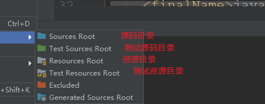

### 4.2配置tomcat

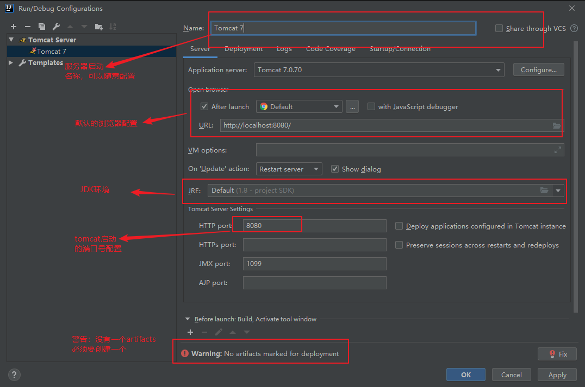

## 5.Servlet

### 5.1Servlet简介

- Servlet是sun公司开发动态web的一门技术
- sun在这些API中提供一个接口叫做：Servlet，如果想要开发一个Servlet程序，只需要完成两个小步骤：
  - 编写一个类，实现Servlet接口
  - 把开发好的java类部署到web服务器中

**把实现了Servlet接口的java程序叫做Servlet**

### 5.2HelloServlet

Servlet接口sun有两个默认的实现类：HttpServlet

1.构建一个maven项目，删除src目录，创建Moudel;此空工程就是项目的父工程

2.新建Moudle，创建web架构

3.编写一个Servlet程序

​	1.编写一个普遍类

​	2.实现Servlet接口，继承HttpServlet

实现原理

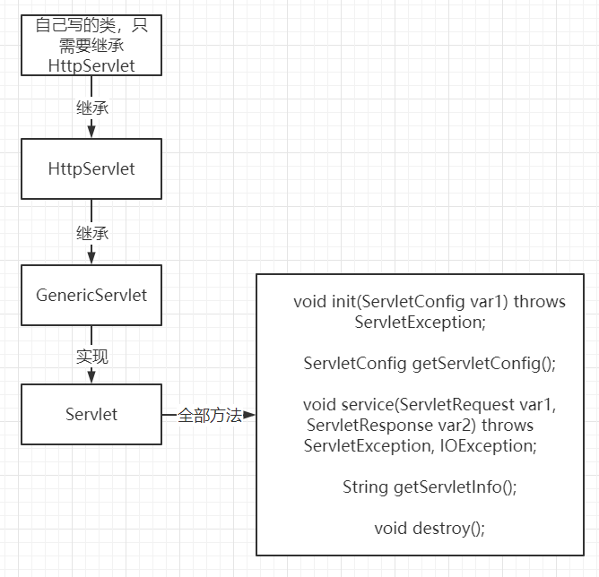

```java
public class HelloServlet extends HttpServlet {
    //由于get/post只是请求实现的方式不同，可以互相调用，业务逻辑都相同
    @Override
    protected void doGet(HttpServletRequest req, HttpServletResponse resp) throws ServletException, IOException {
        PrintWriter writer = resp.getWriter();  //响应流
        writer.print("HelloServlet");
    }

    @Override
    protected void doPost(HttpServletRequest req, HttpServletResponse resp) throws ServletException, IOException {
        doGet(req, resp);
    }
}
```

4.编写Servlet的映射

为什么需要映射：我们写的是JAVA程序，但是要通过浏览器访问，而浏览器需要连接web服务器，所以我们需要在web服务器中注册所写的Servelt，还需要给浏览器访问的地址

```xml
<!--注册Servlet-->
    <servlet>
        <servlet-name>hello</servlet-name>
        <servlet-class>com.xhh.servlet.HelloServlet</servlet-class>
    </servlet>
    <!--Servlet的请求路径-->
    <servlet-mapping>
        <servlet-name>hello</servlet-name>
        <url-pattern>/hello</url-pattern>
    </servlet-mapping>
```

### 5.3Servlet原理

Servlet是由Web服务器，web服务器在收到请求后会进行处理

> Servlet的特点

- Servelt对象，由Servelt容器（Tomcat）创建
- Servelt是一个接口：位于`javax.servlet`包中
- service方法用于接收用户的请求并返回响应
- 用户访问时多次被执行（可以统计网站的访问量）

> Servlet生命周期的方法：以下方法都是由Servlet容器负责调用

> https://www.cnblogs.com/java-chen-hao/p/10688617.html

- 构造器：只被调用一次。只	有第一次调用Servlet时，创建Servlet的实例，调用构造器。==这说明Servlet是单实例的==
- init方法：只被调用一次，在创建好Servlet后立即调用，用于初始化当前Servlet
- service：被多次调用，每次请求都会调用service方法，实际用于响应请求
- destory:只被调用一次，在当前Servlet所在的WEB应用被卸载前调用。用于释放当前Servlet所占的资源

### 5.4Mapping问题

> 一个Servlet可以指定多个映射路径

```xml
    <servlet-mapping>
        <servlet-name>hello</servlet-name>
        <url-pattern>/hello</url-pattern>
    </servlet-mapping>
    <servlet-mapping>
        <servlet-name>hello</servlet-name>
        <url-pattern>/hello2</url-pattern>
    </servlet-mapping>
    <servlet-mapping>
        <servlet-name>hello</servlet-name>
        <url-pattern>/hello3</url-pattern>
    </servlet-mapping>
```

> 一个Servlet可以指定通用映射路径

```xml
    <servlet-mapping>
        <servlet-name>hello</servlet-name>
        <url-pattern>/hello/*</url-pattern>
    </servlet-mapping>
```

```xml
    <!--默认请求路径-->
    <servlet-mapping>
        <servlet-name>hello</servlet-name>
        <url-pattern>/*</url-pattern>
    </servlet-mapping>
```

> 指定一些后缀或者前缀

```xml
    <!--可以自定义后缀实现请求映射
    注意点：*前面不能加映射的路径
    -->
    <servlet-mapping>
        <servlet-name>hello</servlet-name>
        <url-pattern>*.xhh</url-pattern>
    </servlet-mapping>
```

> 优先级问题

指定了固有的映射路径优先级最高，如果找不到就会走默认的处理请求

### 5.5ServletContext

web容器在启动时，会为每一个web程序都创建一个对应的ServletContext对象，代表了当前的web应用

#### 1.共享数据

在Servlet中保存的数据，可以在另外一个Servlet中拿到：

```java
    @Override
    protected void doGet(HttpServletRequest req, HttpServletResponse resp) throws ServletException, IOException {
        ServletContext servletContext = this.getServletContext();
        String name = "张三";
        servletContext.setAttribute("username",name);
    }
```

```java
    @Override
    protected void doGet(HttpServletRequest req, HttpServletResponse resp) throws ServletException, IOException {
        ServletContext servletContext = this.getServletContext();
        String username = (String)servletContext.getAttribute("username");

        resp.setContentType("text/html");
        resp.setCharacterEncoding("utf-8");
        resp.getWriter().print("名字"+username);
    }
```

测试访问结果

#### 2.获取初始化参数

#### 3.请求转发

#### 4.读取资源文件

### 5.6HttpServletResponse

web服务器接收到客户端的http请求，针对这个请求，分别创建一个代表请求的HttpServeltRequest对象，代表响应的一个HttpServletResponse;

- 如果要获取客户端请求的参数：寻找HttpServeltRequest
- 如果要给客户端响应一些信息：找HttpServletResponse

#### 简单分类

> 负责向浏览器发送数据的方法

```java
    ServletOutputStream getOutputStream() throws IOException;
    PrintWriter getWriter() throws IOException;
```

> 负责向浏览器发送响应头的方法

```java
    void setContentLength(int var1);
    void setContentLengthLong(long var1);
    void setContentType(String var1);
    void setBufferSize(int var1);
    void sendError(int var1, String var2) throws IOException;

    void sendError(int var1) throws IOException;

    void sendRedirect(String var1) throws IOException;

    void setDateHeader(String var1, long var2);

    void addDateHeader(String var1, long var2);

    void setHeader(String var1, String var2);

    void addHeader(String var1, String var2);

    void setIntHeader(String var1, int var2);

    void addIntHeader(String var1, int var2);
```

> 状态码

```java
    int SC_CONTINUE = 100;
    int SC_SWITCHING_PROTOCOLS = 101;
    int SC_OK = 200;
    int SC_CREATED = 201;
    int SC_ACCEPTED = 202;
    int SC_NON_AUTHORITATIVE_INFORMATION = 203;
    int SC_NO_CONTENT = 204;
    int SC_RESET_CONTENT = 205;
    int SC_PARTIAL_CONTENT = 206;
    int SC_MULTIPLE_CHOICES = 300;
    int SC_MOVED_PERMANENTLY = 301;
    int SC_MOVED_TEMPORARILY = 302;
    int SC_FOUND = 302;
    int SC_SEE_OTHER = 303;
    int SC_NOT_MODIFIED = 304;
    int SC_USE_PROXY = 305;
    int SC_TEMPORARY_REDIRECT = 307;
    int SC_BAD_REQUEST = 400;
    int SC_UNAUTHORIZED = 401;
    int SC_PAYMENT_REQUIRED = 402;
    int SC_FORBIDDEN = 403;
    int SC_NOT_FOUND = 404;
    int SC_METHOD_NOT_ALLOWED = 405;
    int SC_NOT_ACCEPTABLE = 406;
    int SC_PROXY_AUTHENTICATION_REQUIRED = 407;
    int SC_REQUEST_TIMEOUT = 408;
    int SC_CONFLICT = 409;
    int SC_GONE = 410;
    int SC_LENGTH_REQUIRED = 411;
    int SC_PRECONDITION_FAILED = 412;
    int SC_REQUEST_ENTITY_TOO_LARGE = 413;
    int SC_REQUEST_URI_TOO_LONG = 414;
    int SC_UNSUPPORTED_MEDIA_TYPE = 415;
    int SC_REQUESTED_RANGE_NOT_SATISFIABLE = 416;
    int SC_EXPECTATION_FAILED = 417;
    int SC_INTERNAL_SERVER_ERROR = 500;
    int SC_NOT_IMPLEMENTED = 501;
    int SC_BAD_GATEWAY = 502;
    int SC_SERVICE_UNAVAILABLE = 503;
    int SC_GATEWAY_TIMEOUT = 504;
    int SC_HTTP_VERSION_NOT_SUPPORTED = 505;
```

#### 常见应用

##### 1.向浏览器输出消息

##### 2.下载文件

- 获取下载文件的路径
- 下载的文件名
- 设置让浏览器能够支持下载需要的文件
- 获取下载文件的输入流
- 创建缓冲区
- 获取OutputStream对象
- 将FileOutputStream流写入到buffer缓冲区
- 使用OutputStream将缓冲区中的数据输出到客户端中

```java
public class FileServlet extends HttpServlet {

    @Override
    protected void doGet(HttpServletRequest req, HttpServletResponse resp) throws ServletException, IOException {
        //  - 获取下载文件的路径
        //String realPath = this.getServletContext().getRealPath("/gta5.jpg");
        String realPath = "D:\\idea_Workspace\\javawebStudy\\javaweb-02-servlet\\response\\target\\classes\\gta5.jpg";
//- 下载的文件名
        String fileName = realPath.substring(realPath.lastIndexOf("\\")+1);
//- 设置让浏览器能够支持下载需要的文件
        resp.setHeader("Content-disposition","attachment;fileName"+fileName);
//- 获取下载文件的输入流
        FileInputStream fileInputStream = new FileInputStream(realPath);
//- 创建缓冲区
        int len = 0;
        byte[] buffer = new byte[1024];
//- 获取OutputStream对象
        ServletOutputStream outputStream = resp.getOutputStream();
//- 将FileOutputStream流写入到buffer缓冲区,使用OutputStream将缓冲区中的数据输出到客户端中
        while((len=fileInputStream.read(buffer))>0){
            outputStream.write(buffer,0,len);
        }
        //关闭流
        fileInputStream.close();
        outputStream.close();
    }
```

##### 3.验证码功能

- 后端实现，需要用到Java的图片类，生产一个图片

```java
public class ImageServlet extends HttpServlet {
    @Override
    protected void doGet(HttpServletRequest req, HttpServletResponse resp) throws ServletException, IOException {
        //如何让浏览器5秒自动刷新一次
        resp.setHeader("refresh","3");

        //在内存中创建一个图片
        BufferedImage bufferedImage = new BufferedImage(80,20,BufferedImage.TYPE_INT_RGB);

        //得到图片
        Graphics2D graphics = (Graphics2D) bufferedImage.getGraphics();//🖊
        //设置图片的背景颜色
        graphics.setColor(Color.white);
        graphics.fillRect(0,0,80,20);
        //给图片写数据
        graphics.setColor(Color.blue);
        graphics.setFont(new Font(null,Font.BOLD,20));
        graphics.drawString(makeNum(),0,20);

        //告诉浏览器，这个请求用图片的方式打开
        resp.setContentType("image/jpeg");
        //网站存在缓存，禁止浏览器缓存
        resp.setDateHeader("expires",-1);
        resp.setHeader("Cache-Control","no-cache");
        resp.setHeader("Pragma","no-cache");

        //把图片写给浏览器
        ImageIO.write(bufferedImage,"jpg",resp.getOutputStream());
    }

    //生成随机数
    private String makeNum(){
        Random random = new Random();
        String num = random.nextInt(9999999)+"";
        StringBuffer sb = new StringBuffer();
        for (int i = 0; i < 7-num.length() ; i++) {
            sb.append("0");
        }
        num = sb.toString() + num;
        return num;
    }
```

##### ==4.实现重定向==

一个web资源收到客户端请求后，会通知客户端去访问另外一个web资源，这个过程叫做重定向

常见场景：用户登入

`void sendRedirect(String var1) throws IOException;`

> 重定向和转发

相同点：

- 页面都会实现跳转

不同点：

- 请求转发的时候，url不会产生变化 307
- 重定向时，url会发生变化 302

```java
    protected void doGet(HttpServletRequest req, HttpServletResponse resp) throws ServletException, IOException {
        //处理请求
        String username = req.getParameter("username");
        String password = req.getParameter("password");

        System.out.println(username+":"+password);
        //重定向时需要注意路径问题
        resp.sendRedirect("/success.jsp");
    }
```

### 5.7HttpServletRequest

HttpServletRequest代表客户端的请求，用户通过Http协议访问服务器，HTTP请求中的所有信息都会被封装到HttpServletRequest,通过HttpServletRequest的方法，获取客户端的所有信息

#### 1.获取前端参数HttpServletRequest

`getParameter(String s)`和`getParameterValues(String s)`

#### 2.请求转发

```java
public class LoginServlet extends HttpServlet {
    @Override
    protected void doGet(HttpServletRequest req, HttpServletResponse resp) throws ServletException, IOException {
        req.setCharacterEncoding("utf-8");
        resp.setCharacterEncoding("utf-8");
        String username = req.getParameter("username");
        String password = req.getParameter("password");
        String[] hobbys = req.getParameterValues("hobbys");

        //控制台输出
        System.out.println(username);
        System.out.println(password);
        System.out.println(Arrays.toString(hobbys));

        //请求转发
        req.getRequestDispatcher(req.getContextPath()+"/success.jsp").forward(req,resp);
    }
```

## 6.Cookie,Session

### 6.1会话

**会话**用户打开一个浏览器，点击了很多超链接，访问多个web资源，关闭浏览器，这个过程叫做会话

**一个网站，怎么证明你来过？**

客户端		服务端

1.服务端给客户端一个信件，客户端下次访问服务器端带上信件就可以了；cookie

2.服务器登记你来过了，下次来的时候匹配；session

### 6.2保存会话的两种技术

##### cookie                                                                                                                                                                                                                                                                                                                                                                                                                                                                                                                                                                                                                                                                                                                                                                                                                                                                                                                                                                                                                                                                                                                                                                                                                                                                                                                                                                                                                                                                                                                                                                                                                                                                                                                                                                                                                                                                                                                                                                                                                                                                                                                                                                                                                                                                                                                                                                                                                                                                                                                                                                                                                                                                                                                                                                                                                                                                                                                                                                                                                                                                                                                                                                                                                                                                                                                                                                                                                                                                           

- 客户端技术（响应，请求）

##### session

- 服务器技术，利用这个技术，可以保存用户的会话信息；可以把信息或者数据放在session中

### 6.3Cookie

1.从请求中拿到cookie信息

2.服务器响应给客户端cookie

```java
Cookie[] cookies = req.getCookies(); //获得cookie
cookie.getName();//获得Cookie的key
cookie.getValue();//获得cookie中的value
;//新建一个cookie
cookie.setMaxAge(24*60*60);//设置cookie的保存时间
resp.addCookie(cookie);//给客户端响应一个cookie
```

一个网站的cookie存在上限

- 一个cookie只能保存一个信息
- 一个web站点可以给浏览器发送多个cookie，最多存放20个cookie
- cookie大小有限制
- 300个cookie为浏览器上限

删除cookie

- 不设置有效期，关闭浏览器自动失效
- 设置有效期时间为0

### 6.4Session（重点）

什么是Session:

- 服务器会给每一个用户（浏览器）创建一个Session对象
- 一个session独占一个浏览器，浏览器没有关闭，这个session就一直存在
- 用户登入之后，整个网站都可以访问（保存用户的信息）

> session和cookie的区别

- Cookie把用户的数据写给用户的浏览器，浏览器保存（可以保存多个）
- Session把用户的数据写到用户独占的Session中，服务器端保存（保存重要的信息，减少服务器资源的浪费）
- Session对象由服务器创建 

> 使用场景

- 保存用户登入的信息
- 购物车信息
- 在整个网站中经常会使用的数据，保存在Session中       

```java
public class SessionDemo01 extends HttpServlet {
    @Override
    protected void doGet(HttpServletRequest req, HttpServletResponse resp) throws ServletException, IOException {
       //解决乱码问题
       req.setCharacterEncoding("utf-8");
       resp.setCharacterEncoding("utf-8");
       resp.setContentType("text/html;charset=utf-8");
       //获取session
        HttpSession session = req.getSession();
        //在session中存入信息
        session.setAttribute("name",new Person("张三",19));
        if(session.isNew()){
            resp.getWriter().write("这个session是新创建的，"+session.getId());
        }else {
            resp.getWriter().write("这个session是已经存在的，"+session.getId());
        }
    }
    /*
    Session创建时：
        Cookie cookie = new Cookie("JSESSIONID"，sessionId);
        resp.addCookie(cookie);
     */
```

```java
public class SessionDemo02 extends HttpServlet {
    @Override
    protected void doGet(HttpServletRequest req, HttpServletResponse resp) throws ServletException, IOException {
        //解决乱码问题
        req.setCharacterEncoding("utf-8");
        resp.setCharacterEncoding("utf-8");
        resp.setContentType("text/html;charset=utf-8");
        //获得Session
        HttpSession session = req.getSession();
        Person name = (Person) session.getAttribute("name");
        System.out.println(name);
    }
```

Session自动过期，在web.xml中设置

```xml
     <!--设置Session默认的失效时间-->
    <session-config>
        <!--15分钟后Session自动失效，以分钟为单位-->
        <session-timeout>15</session-timeout>
    </session-config>
```

## 7.jsp

### 7.1什么是jsp

Java Server Pages :Java服务端页面，也和Servlet一样，用于动态web技术

> 特点

- 写jsp就像是在写HTML
- 区别：
  - html只给用户提供静态的数据
  - jsp页面中可以嵌入java代码，为用户提供动态数据

### 7.2.jsp原理

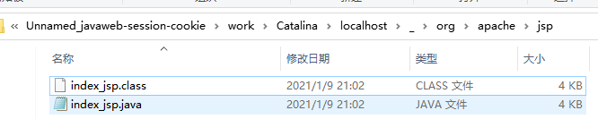

通过查看文件发现页面转化为java程序

**浏览器向服务器发送请求，不管访问什么资源，其实都是在访问Servlet**

**jsp本质上就是一个Servlet**

```java
//初始化 
public void _jspInit() {);
  }
//销毁
  public void _jspDestroy() {
  }
//JSPService
public void _jspService(final javax.servlet.http.HttpServletRequest request, final javax.servlet.http.HttpServletResponse response)
        throws java.io.IOException, javax.servlet.ServletException 
```

1.判断请求

2.内置一些对象

```java
    final javax.servlet.jsp.PageContext pageContext;			//页面上下文
    javax.servlet.http.HttpSession session = null;				 //session
    final javax.servlet.ServletContext application;				   //application
    final javax.servlet.ServletConfig config;					//config
    javax.servlet.jsp.JspWriter out = null;						//out
    final java.lang.Object page = this;						    //page:当前页
    HttpServletRequest request							   //请求
    HttpServletResponse reponse							  //响应
```

3.输出页面前增加的代码

```java
      response.setContentType("text/html;charset=UTF-8");
      pageContext = _jspxFactory.getPageContext(this, request, response,
      			null, true, 8192, true);
      _jspx_page_context = pageContext;
      application = pageContext.getServletContext();
      config = pageContext.getServletConfig();
      session = pageContext.getSession();
      out = pageContext.getOut();
      _jspx_out = out;
```

### 7.3.JSP基础语法

#### jsp表达式

```jsp
  <%--JSP表达式
  作用：用来将程序的输出，输出到客户端
  <%= 变量或者表达式%>
  --%>
  <%= new java.util.Date()%>
```

#### jsp脚本片段

```jsp
  <%--JSP脚本片段--%>
  <%
    int sum = 0;
    for(int i=0;i<=100;i++){
      sum+=i;
    }
    out.println("<h1>Sum="+sum+"</h1>");
  %>                         
```

**再实现**

```jsp
  <%--在代码嵌入html元素--%>
  <%
    for(int i=0;i<5;i++){
      %>
  <h1>Hello World<%=i%></h1>
  <%
    }
  %>
```

#### JSP声明

jsp声明：会被编译到jsp生成Java类中，其他会被生成到jspservice方法中

```jsp
<%%>
<%=%>
<%!%>
<%--注释--%>
```

### 7.4.JSP指令

```jsp
<%@ page ....>

<%--@include会将两个页面合二为一，当作一个页面输出--%>
    <%@include file="common/header.jsp"%>
    <h1>网页主体</h1>
    <%@include file="common/footer.jsp"%>
<%--jsp:include本质是拼接页面，还是3个页面--%>
<jsp:include page="common/header.jsp"/>
<h1>网页主体</h1>
<jsp:include page="common/footer.jsp"/>
```

### 7.5.        

- PageContext：通过该对象可以获取其他对象
- Request：封装客户端的请求
- Response：封装服务器对客户端的响应
- Session：封装用户会话
- Application：封装服务器运行环境的对象
- config：Web应用的配置对象
- out：输出服务器响应的输出流对象
- page：JSP页面本身
- exception ：封装页面抛出异常的对象

```javascript
<%--内置对象--%>
<%
    pageContext.setAttribute("name1","1hao");//保存的数据只在一个页面中有效
    request.setAttribute("name2","2hao");//保存的数据只在一次请求中有效，请求转发会携带这个数据
    session.setAttribute("name3","3hao");//保存的数据只在一次会话中有效，从打开浏览器到关闭浏览器
    application.setAttribute("name4","4hao");//保存的数据在服务器中有效，从打开服务器到关闭服务器
%>

<%
    //从pageContext取出，通过寻找方式
    String name1 = (String)pageContext.findAttribute("name1");
    String name2 = (String)pageContext.findAttribute("name2");
    String name3 = (String)pageContext.findAttribute("name3");
    String name4 = (String)pageContext.findAttribute("name4");
    String name5 = (String)pageContext.findAttribute("name5");//不存在

%>

<%--使用El表达式输出 ${}--%>
<h1>取出的值为：</h1>
<h3>${name1}</h3>
<h3>${name2}</h3>
<h3>${name3}</h3>
<h3>${name4}</h3>
<h3><%=name5%></h3>
```

### 7.6.JSP标签，JSTL标签，EL表达式

```xml
        <!--JSTL表达式的依赖-->
        <!-- https://mvnrepository.com/artifact/javax.servlet.jsp.jstl/jstl-api -->
        <dependency>
            <groupId>javax.servlet.jsp.jstl</groupId>
            <artifactId>jstl-api</artifactId>
            <version>1.2</version>
        </dependency>
        <!--standard标签库-->
        <!-- https://mvnrepository.com/artifact/taglibs/standard -->
        <dependency>
            <groupId>taglibs</groupId>
            <artifactId>standard</artifactId>
            <version>1.1.2</version>
        </dependency>
```

#### EL表达式：`${}`

- 获取数据
- 执行运算
- 获取web开发的常用对象

#### JSP标签

```jsp
<%--http://localhost:8080jsptag.jsp?name=张三&age=18--%>
<jsp:forward page="jsptag2.jsp">
    <jsp:param name="name" value="zz"/>
    <jsp:param name="age" value="18"/>
</jsp:forward>
```

#### JSTL表达式

JSTL标签库的使用是为了弥补HTML标签的不足；

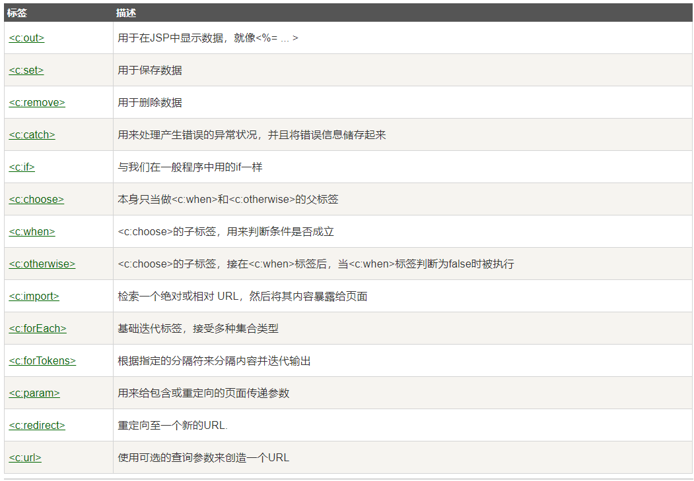

**JSTL标签使用步骤**

- 引入对应的taglib
- 使用其中的方法
- **tomcat中也需要导入jar包，报错**

```jsp
<body>
<h4>if测试</h4>
<form action="coreif.jsp" method="get">
    <%--EL表达式获取表单中的数据
        ${param.参数名}
    --%>
    <input type="text" name="username" value="${param.username}">
        <input type="submit" value="登入">
</form>
<%--判断提交的用户名是否为管理员，登入成功--%>
<c:if test="${param.username=='admin'}" var="isAdmin">
    <c:out value="管理员欢迎你"/>
</c:if>
<c:out value="${isAdmin}"/>
</body>
```

```jsp
<%--定义一个变量scope,值为85--%>
<c:set var="scope" value="85"/>

<c:choose>
    <c:when test="${scope>=90}">你的成绩为优秀</c:when>
    <c:when test="${scope>=80}">你的成绩为良好</c:when>
    <c:when test="${scope>=70}">你的成绩为一般</c:when>
    <c:when test="${scope>=60}">你的成绩为还行</c:when>
</c:choose>
```

```jsp
<body>
<%
    ArrayList<String> people = new ArrayList<>();
    people.add(0,"张三");
    people.add(1,"李四");
    people.add(2,"王五");
    people.add(3,"赵六");
    people.add(4,"老七");
    request.setAttribute("list",people);
%>
<%--
    var:每一次遍历出来的变量
--%>
<c:forEach var="people" items="${list}">
    <c:out value="${people}"/>
</c:forEach>

<c:forEach var="people" items="${list}" begin="1" end="3" step="2">
    <c:out value="${people}"/>
</c:forEach>
</body>
```

## 8.JavaBean

实体类

JavaBean有特定的写法：
- 必须要有一个无参构造
- 属性必须私有化
- 必须要有对应的get/set方法

一般用来和数据库的字段做映射 ORM;
ORM:对象关系映射
- 表-----类
- 字段----属性
- 行记录---对象

**people表**

| id | name | age | adress |
| ---- | ---- | ---- | ---- |
| 1 | 1号    | 11 | ssad |
| 2 | 2号 | 12 | sss |
| 3 | 3号 | 13 | ssss |

对应的类

```java
class People{
    private int id;
    private String name;
    private int age;
    private String adress;
}
```

```jsp
<%
//    People people = new People();
//    people.setId(18);
//    people.setAge(18);
//    people.setName("xhh");
//    people.setAddress("jsxncs");
%>
<jsp:useBean id="people" class="com.xhh.pojo.People" scope="page"/>
<jsp:setProperty name="people" property="id" value="18"/>
<jsp:setProperty name="people" property="age" value="18"/>
<jsp:setProperty name="people" property="name" value="xhh"/>
<jsp:setProperty name="people" property="address" value="jsxncs"/>

id：<jsp:getProperty name="people" property="id"/>
姓名：<jsp:getProperty name="people" property="name"/>
年龄：<jsp:getProperty name="people" property="age"/>
住址：<jsp:getProperty name="people" property="address"/>
```

## 9.MVC三层架构

什么是MVC:Model  view Controller 模型，视图，控制器

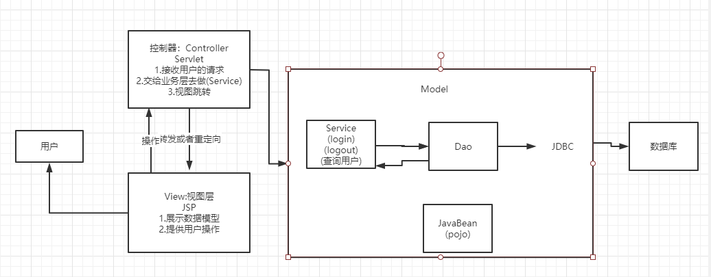

Model

- 业务处理：业务逻辑(Service)
- 数据持久层:CRUD(DAO)

View

- 展示数据
- 提供链接发起Servlet请求

Controller(Servlet)
- 接收用户请求
- 交给业务层处理对应的代码
- 控制视图的跳转

```java
登入--->接收用户的登入请求--->处理用户的请求（获取用户登入的参数,username,password）--->交给业务层处理登入业务（判断用户名密码是否正确）--->Dao层查询用户名和密码是否正确
```

## 10.Filter
Filter:过滤器，用来过滤网站的数据
- 处理中文乱码
- 登入验证...

Filter开发步骤：
- 导入maven依赖
- 编写过滤器

实现Filter,重写方法

```java
    public void doFilter(ServletRequest servletRequest, ServletResponse servletResponse, FilterChain filterChain) throws IOException, ServletException {
        servletRequest.setCharacterEncoding("utf-8");
        servletResponse.setCharacterEncoding("utf-8");
        servletResponse.setContentType("text/html;charset=UTF-8");
        /**
         * 1.过滤所有的代码，在过滤特定请求时都会执行
         * 2.必须要让过滤器继续执行
         */
        System.out.println("前");
        filterChain.doFilter(servletRequest,servletResponse);//让请求继续执行
        System.out.println("后");
    }
```
- 在web.xml中配置Filter

```xml
    <filter>
        <filter-name>CharacterEncodingFilter</filter-name>
        <filter-class>com.xhh.filter.CharacterEncodingFilter</filter-class>
    </filter>
    <filter-mapping>
        <filter-name>CharacterEncodingFilter</filter-name>
        <!--只要是/servlet下的任何请求都会经过这个过滤器-->
        <url-pattern>/servlet/*</url-pattern>
    </filter-mapping>
```

## 11.监听器

```java
//统计网站在线人数：统计session
public class OnlineCountListener implements HttpSessionListener {
    //创建Session监听
    public void sessionCreated(HttpSessionEvent httpSessionEvent) {
        ServletContext servletContext = httpSessionEvent.getSession().getServletContext();
        Integer onlineCount = (Integer)servletContext.getAttribute("OnlineCount");
        if(onlineCount==null){
            onlineCount = new Integer(1);
        }else{
            int count = onlineCount.intValue();
            onlineCount = new Integer(count+1);
        }
        servletContext.setAttribute("OnlineCount",onlineCount);
    }
//销毁
    public void sessionDestroyed(HttpSessionEvent httpSessionEvent) {
        ServletContext servletContext = httpSessionEvent.getSession().getServletContext();
        Integer onlineCount = (Integer)servletContext.getAttribute("OnlineCount");
        if(onlineCount==null){
            onlineCount = new Integer(0);
        }else{
            int count = onlineCount.intValue();
            onlineCount = new Integer(count-1);
        }
        servletContext.setAttribute("OnlineCount",onlineCount);
    }
}
```

web.xml中注册监听器

```xml
    <!--注册监听器-->
    <listener>
        <listener-class>com.xhh.listener.OnlineCountListener</listener-class>
    </listener>
```

## 12.过滤器，监听器常见应用
> 监听器：GUI（图形界面）编程中经常使用

> 用户登入之后才能进入主页！用户注销后不能进入主页

- 用户登入之后，向Session中放入用户的数据
```java
    protected void doGet(HttpServletRequest req, HttpServletResponse resp) throws ServletException, IOException {
        String username = req.getParameter("username");
        if(username.equals("admin")){//登入成功
            req.getSession().setAttribute("USER_SESSION",req.getSession().getId());
            resp.sendRedirect("/sys/success.jsp");
        }else {
            resp.sendRedirect("/error.jsp");
        }
    }
```

- 进入主页时判断用户是否登入；过滤器实现

```java
   public void doFilter(ServletRequest servletRequest, ServletResponse servletResponse, FilterChain filterChain) throws IOException, ServletException {
        HttpServletRequest  request = (HttpServletRequest)servletRequest;
        HttpServletResponse response = (HttpServletResponse)servletResponse;

        if(request.getSession().getAttribute("USER_SESSION")==null){
            response.sendRedirect("/login.jsp");
        }
        filterChain.doFilter(servletRequest,servletResponse);
    }
```

## 13.JDBC复习

需要的jar包：

- java.sql
- javax.sql
- mysql-connector-java...

实验环境搭建

- 新建SQL表

```sql
CREATE TABLE `users` (
  `id` int(6) NOT NULL DEFAULT '0',
  `name` varchar(20) DEFAULT NULL,
  `password` varchar(40) DEFAULT NULL,
  `email` varchar(40) DEFAULT NULL,
  `birthday` date DEFAULT NULL,
  PRIMARY KEY (`id`)
) ENGINE=InnoDB DEFAULT CHARSET=utf8
```

- 代码实现

```java
public class TestJdbc {
    public static void main(String[] args) throws ClassNotFoundException, SQLException {
        //配置信息
        String url = "jdbc:mysql://localhost:3306/jdbc?useUnicode=true&characterEncoding=utf-8";
        String username = "root";
        String password = "xhh1999.02.10";

        //加载驱动
        Class.forName("com.mysql.jdbc.Driver");
        //连接数据库
        Connection connection = DriverManager.getConnection(url, username, password);
        //向数据库发送SQL的对象Statement:CRUD
        Statement statement = connection.createStatement();
        //编写SQL语句
        String sql="select * from users";
        //执行SQL
        ResultSet resultSet = statement.executeQuery(sql);
        while (resultSet.next()){
            System.out.println("id="+resultSet.getObject("id"));
            System.out.println("name="+resultSet.getObject("name"));
            System.out.println("password="+resultSet.getObject("password"));
            System.out.println("email="+resultSet.getObject("email"));
            System.out.println("birthday="+resultSet.getObject("birthday"));
        }
        //关闭连接，释放资源(先开后关)
        resultSet.close();
        statement.close();
        connection.close();
    }
}
```

# 项目搭建

- 搭建Maven项目，配置Tomcat
- 导入Jar包
- 创建项目包结构

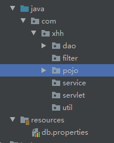

- 编写实体类

  ORM映射：表-类映射

- 编写基础公共类

  - 数据库配置文件

  ```properties
  driver=com.mysql.jdbc.Driver
  url=jdbc:mysql://localhost:3306/smbms?useUnicode=true&characterEncoding=utf-8
  username=root
  password=xhh1999.02.10
  ```

  - 编写数据库的公共类

```java
package com.xhh.dao;

import java.io.IOException;
import java.io.InputStream;
import java.sql.*;
import java.util.Properties;

/**
 * @author xhh
 * @date 2021/2/10 16:53
 */
//操作数据库的公共类
public class BaseDao {
    private static String driver;
    private static String url;
    private static String username;
    private static String password;
    //静态代码块，类加载时就被初始化
    static {
        Properties properties = new Properties();
        //通过对应的类加载器读取对应的资源
        InputStream resourceAsStream = BaseDao.class.getClassLoader().getResourceAsStream("db.properties");
        try {
            properties.load(resourceAsStream);
        } catch (IOException e) {
            e.printStackTrace();
        }
        driver = properties.getProperty("driver");
        url = properties.getProperty("url");
        username = properties.getProperty("username");
        password = properties.getProperty("password");
    }
    //获取数据库的连接
    public static Connection getConnection(){
        Connection connection = null;
        try {
            Class.forName(driver);
            connection = DriverManager.getConnection(url,username,password);
        } catch (Exception e) {
            e.printStackTrace();
        }
        return connection;
    }
    //编写查询公共类
    public static ResultSet execute(Connection connection, String sql, Object[] params, ResultSet resultSet, PreparedStatement preparedStatement) throws SQLException {
        preparedStatement = connection.prepareStatement(sql);

        for(int i=1;i<params.length;i++){
            preparedStatement.setObject(i+1,params[i]);
        }

        resultSet = preparedStatement.executeQuery(sql);
        return resultSet;
    }
    //编写增删改公共方法
    public static int execute(Connection connection, String sql, Object[] params,PreparedStatement preparedStatement) throws SQLException {
        preparedStatement = connection.prepareStatement(sql);

        for(int i=1;i<params.length;i++){
            preparedStatement.setObject(i+1,params[i]);
        }

        int updateRows = preparedStatement.executeUpdate(sql);
        return updateRows;
    }
    //释放资源
    public static boolean closeResource(Connection connection,PreparedStatement preparedStatement,ResultSet resultSet){
        boolean flag = true;
        if(resultSet!=null){
            try {
                resultSet.close();
                //GC回收
                resultSet = null;
            } catch (SQLException e) {
                e.printStackTrace();
                flag = false;
            }
        }

        if(preparedStatement!=null){
            try {
                preparedStatement.close();
                preparedStatement = null;
            } catch (SQLException e) {
                e.printStackTrace();
                flag = false;
            }
        }

        if(connection!=null){
            try {
                connection.close();
                connection = null;
            } catch (SQLException e) {
                e.printStackTrace();
                flag = false;
            }
        }
        return flag;
    }
}
```

- 编写过滤器

```java

    public void doFilter(ServletRequest servletRequest, ServletResponse servletResponse, FilterChain filterChain) throws IOException, ServletException {
        servletRequest.setCharacterEncoding("utf-8");
        servletResponse.setCharacterEncoding("utf-8");
        servletResponse.setContentType("text/html;charset=utf-8");

        filterChain.doFilter(servletRequest,servletResponse);
    }
```

- 导入静态资源

# 登入功能实现

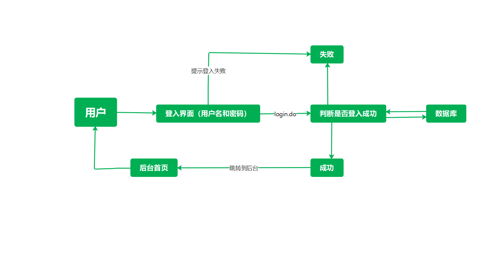

1.编写前端页面

2.设置首页

```xml
    <!--设置欢迎页面-->
    <welcome-file-list>
        <welcome-file>login.jsp</welcome-file>
    </welcome-file-list>
```

3.编写dao层登入用户的接口

```java
    //得到要登入的用户
    public User getLoginUser(Connection connection,String userCode);
```

4.编写dao接口的实现类

```java
public class UserDaoImpl implements UserDao {
    public User getLoginUser(Connection connection, String userCode) {
        PreparedStatement preparedStatement = null;
        ResultSet resultSet = null;
        User user = null;

        if(connection!=null){
            String sql = "select * from user where userCode=?";
            Object[] params = {userCode};
            try {
                resultSet = BaseDao.execute(connection,sql,params,resultSet,preparedStatement);
                if(resultSet.next()){
                    user = new User();
                    user.setId(resultSet.getInt("id"));
                    user.setUserCode(resultSet.getString("userCode"));
                    user.setUserName(resultSet.getString("userName"));
                    user.setUserPassword(resultSet.getString("userPassword"));
                    user.setGender(resultSet.getInt("gender"));
                    user.setBirthday(resultSet.getDate("birthday"));
                    user.setPhone(resultSet.getString("phone"));
                    user.setAddress(resultSet.getString("address"));
                    user.setUserRole(resultSet.getInt("userRole"));
                    user.setCreatedBy(resultSet.getInt("createdBy"));
                    user.setCreationDate(resultSet.getTimestamp("creationDate"));
                    user.setModifyBy(resultSet.getInt("modifyBy"));
                    user.setModifyDate(resultSet.getTimestamp("modifyDate"));
                }
                BaseDao.closeResource(connection,preparedStatement,resultSet);
            } catch (SQLException e) {
                e.printStackTrace();
            }
        }
        return user;
    }
} 
```


5.业务层接口

```java
    //用户登入
    public User login(String userCode,String password);
```
6.业务层实现类

```java
public class UserServiceImpl implements UserService {
    //业务层会调用dao层，需要引入Dao层
    //private UserDao userDao = new UserDaoImpl();
    private UserDao userDao;
    public UserServiceImpl(){
        userDao = new UserDaoImpl();
    }

    public User login(String userCode, String password) {
        Connection connection = BaseDao.getConnection();;
        User user = userDao.getLoginUser(connection, userCode);
        BaseDao.closeResource(connection,null,null);
        return user;
    }
}
```

7.编写Servlet

```java
    //Servlet:控制层，调用业务层代码
    @Override
    protected void doGet(HttpServletRequest req, HttpServletResponse resp) throws ServletException, IOException {
        System.out.println("loginServlet--start");

        //获取用户名和密码
        String userCode = req.getParameter("userCode");
        String userPassword = req.getParameter("userPassword");

        //和数据库中的密码进行对比，调用业务层
        UserServiceImpl userService = new UserServiceImpl();
        User login = userService.login(userCode, userPassword);
        if(login!=null){
            //将用户的信息放入到Session中
            req.getSession().setAttribute(Constants.USER_SESSION,login);
            //跳转到主页
            resp.sendRedirect("jsp/frame.jsp");
        }else {
            //转发回登入页面，提示用户名或密码错误
            req.setAttribute("error","用户名或者密码错误");
            req.getRequestDispatcher("login.jsp").forward(req,resp);
        }
    }
```

8.注册Servlet,测试访问，确保以上功能成功


# 登入功能优化

注销功能实现
```java
    protected void doGet(HttpServletRequest req, HttpServletResponse resp) throws ServletException, IOException {
        req.getSession().removeAttribute(Constants.USER_SESSION);
        resp.sendRedirect(req.getContextPath()+"/login.jsp");//返回登入页面
    }
```
#登入拦截

编写过滤器

```java
    public void doFilter(ServletRequest servletRequest, ServletResponse servletResponse, FilterChain filterChain) throws IOException, ServletException {
        HttpServletRequest request = (HttpServletRequest)servletRequest;
        HttpServletResponse response = (HttpServletResponse)servletResponse;

        //过滤器从Session中获取用户
        User user = (User)request.getSession().getAttribute(Constants.USER_SESSION);
        if(user==null){ //说明用户没有登入或者已经注销
            response.sendRedirect("/smbms/error.jsp");
        }else {
            filterChain.doFilter(servletRequest,servletResponse);
        }
    }
```

注册，测试功能

# 密码修改
1.导入前端素材
2.编写dao层

```java
    public int updatePwd(Connection connection, int id, String password) {
        PreparedStatement preparedStatement = null;
        int updateRow = 0;
        String sql = "update smbms_user set userPassword=? where id=?";
        Object[] params= {password,id};
        if(connection!=null){
            try {
                updateRow = BaseDao.execute(connection, sql, params, preparedStatement);
                BaseDao.closeResource(connection,preparedStatement,null);
            } catch (SQLException e) {
                e.printStackTrace();
            }
        }
        return updateRow;
    }
```
3.编写service层

```java
    public boolean updatePwd(int id, String pwd) {
        Connection connection = BaseDao.getConnection();
        boolean flag = false;
        if(userDao.updatePwd(connection,id,pwd)>0){
            flag = true;
        }
        BaseDao.closeResource(connection,null,null);
        return flag;
    }
```
4.编写Servlet层

```java
    @Override
    protected void doGet(HttpServletRequest req, HttpServletResponse resp) throws ServletException, IOException {
        //从Session中获取id
        User user = (User)req.getSession().getAttribute(Constants.USER_SESSION);
        boolean flag = false;
        String newpassword = req.getParameter("newpassword");
        if(user!=null && !StringUtils.isNullOrEmpty(newpassword)){
            UserService userService = new UserServiceImpl();
            flag = userService.updatePwd(user.getId(),newpassword);
            if(flag){
                req.setAttribute("message","修改密码成功，请使用新密码登入");
                //移除Session
                req.getSession().removeAttribute(Constants.USER_SESSION);
            }else {
                req.setAttribute("message","密码修改失败！");
            }
        }else {
            req.setAttribute("message","新密码出现问题");
        }
        req.getRequestDispatcher("pwdmodify.jsp").forward(req,resp);
    }
```

实现Servlet的复用
```java
    @Override
    protected void doGet(HttpServletRequest req, HttpServletResponse resp) throws ServletException, IOException {
        String method = req.getParameter("method");
        if(method.equals("savepwd")){
            this.updatePwd(req, resp);
        }
    }
```
## 优化密码修改使用Ajax
1.使用fastjson，导入阿里巴巴的jar包

```xml
        <!-- https://mvnrepository.com/artifact/com.alibaba/fastjson -->
        <dependency>
            <groupId>com.alibaba</groupId>
            <artifactId>fastjson</artifactId>
            <version>1.2.61</version>
        </dependency>
```

2.编写代码

```java
   //验证旧密码,从session中获取用户密码
    public void pwdModify(HttpServletRequest request,HttpServletResponse response){
        //获取Session中用户id
        User user = (User)request.getSession().getAttribute(Constants.USER_SESSION);
        String oldpassword = request.getParameter("oldpassword");
        Map<String, String> resultMap = new HashMap<String, String>();
        if(user==null){//Session失效
            resultMap.put("result","sessionerror");
        }else if(StringUtils.isNullOrEmpty(oldpassword)){
            resultMap.put("result","error");
        }else {
            String userPassword = user.getUserPassword();
            if(oldpassword.equals(userPassword)){
                resultMap.put("result","true");
            }else {
                resultMap.put("result","false");
            }
        }

        try {
            response.setContentType("application/json");
            PrintWriter writer = response.getWriter();
            //JSONArray 阿里巴巴的JSON工具类，转换格式
            writer.write(JSONArray.toJSONString(resultMap));
            writer.flush();
            writer.close();
        } catch (IOException e) {
            e.printStackTrace();
        }
    }
```

3.测试功能

# 用户管理实现

## 1.获取用户数量

导入分页工具类
1.userDao

```java
    //根据用户名或角色查询用户总数
    public int getUserCount(Connection connection, String username, int userRole) {
        connection = BaseDao.getConnection();
        PreparedStatement preparedStatement = null;
        int count = 0;
        ResultSet resultSet = null;
        ArrayList<Object> list = new ArrayList<Object>();//存放参数

        if(connection!=null){
            StringBuffer sql = new StringBuffer();
            sql.append("select count(1) as count from smbms_user u,smbms_role r where u.userRole = r.id");
            if(!StringUtils.isNullOrEmpty(username)){
                sql.append(" and u.userName like ?");
                list.add("%"+username+"%");//index:0
            }
            if(userRole>0){
                sql.append(" and u.userRole = ?");
                list.add(userRole);//index:1
            }
            //把list转换为数组
            Object[] params = list.toArray();
            System.out.println("UserDaoImpl-->getUserCount"+sql.toString());//输出完整的SQL语句
            try {
                resultSet = BaseDao.execute(connection, null, null, sql.toString(), params);
                if(resultSet.next()){
                    count = resultSet.getInt("count");
                }
            } catch (SQLException e) {
                e.printStackTrace();
            }finally {
                BaseDao.closeResource(null,null,resultSet);
            }
        }
        return count;
    }
```
2.Service

```java
    public int getUserCount(String username, int userRole) {
        Connection connection = BaseDao.getConnection();
        int userCount = userDao.getUserCount(connection, username, userRole);
        BaseDao.closeResource(connection,null,null);
        return userCount;
    }
```
## 2.获取用户列表
1.userDao层

```java
    public List<User> getUserList(Connection connection, String userName, int userRole, int currentPageNo, int pageSize) {
        connection = BaseDao.getConnection();
        PreparedStatement preparedStatement = null;
        ResultSet resultSet = null;
        List<User> userList = new ArrayList<User>();
        if(connection!=null){
            StringBuffer sql = new StringBuffer();
            sql.append("select u.*,r.roleName as userRoleName from smbms_user u,smbms_role r where u.userRole = r.id");
            List<Object> list = new ArrayList<Object>();
            if(!StringUtils.isNullOrEmpty(userName)){
                sql.append(" and u.userName like ?");
                list.add("%"+userName+"%");//index:0
            }
            if(userRole>0){
                sql.append(" and u.userRole = ?");
                list.add(userRole);//index:1
            }
            sql.append(" order by creationDate DESC limit ?,?");
            currentPageNo = (currentPageNo-1)*pageSize;
            list.add(currentPageNo);
            list.add(pageSize);

            Object[] params = list.toArray();
            System.out.println("sql ----> " + sql.toString());
            try {
                resultSet = BaseDao.execute(connection, preparedStatement, resultSet, sql.toString(), params);
                while(resultSet.next()){
                    User user = new User();
                    user.setId(resultSet.getInt("id"));
                    user.setUserCode(resultSet.getString("userCode"));
                    user.setUserName(resultSet.getString("userName"));
                    user.setGender(resultSet.getInt("gender"));
                    user.setBirthday(resultSet.getDate("birthday"));
                    user.setPhone(resultSet.getString("phone"));
                    user.setUserRole(resultSet.getInt("userRole"));
                    user.setUserRoleName(resultSet.getString("userRoleName"));
                    userList.add(user);
                }
            } catch (SQLException e) {
                e.printStackTrace();
            }finally {
                BaseDao.closeResource(null, null, resultSet);
            }
        }
        return userList;
        }
```

2.Service层

```java
    public List<User> getUserList(String userName, int userRole, int currentPageNo, int pageSize) {
        Connection connection = BaseDao.getConnection();
        List<User> userList = userDao.getUserList(connection, userName, userRole, currentPageNo, pageSize);
        BaseDao.closeResource(connection,null,null);
        return userList;
    }
```

## 3.获取角色列表

1.Dao层

```java
    public List<Role> getRoleList(Connection connection) {
        connection = BaseDao.getConnection();
        PreparedStatement preparedStatement = null;
        ResultSet resultSet = null;
        ArrayList<Role> roles = new ArrayList<Role>();
        if(connection!=null){
            String sql = "select * from smbms_role";
            Object[] params = {};
            try {
                resultSet = BaseDao.execute(connection,null,null,sql,params);
                while (resultSet.next()){
                    Role role = new Role();
                    role.setId(resultSet.getInt("id"));
                    role.setRoleName(resultSet.getString("roleName"));
                    role.setRoleCode(resultSet.getString("roleCode"));
                    roles.add(role);
                }
            } catch (SQLException e) {
                e.printStackTrace();
            }finally {
                BaseDao.closeResource(connection,null,null);
            }
        }
        return roles;
    }
```

2.Service层

```java
    public List<Role> getRoleList() {
        Connection connection = BaseDao.getConnection();
        List<Role> roleList = roleDao.getRoleList(connection);
        BaseDao.closeResource(connection,null,null);
        return roleList;
    }
```

# 文件上传

```java
package com.xhh.servlet;

import org.apache.commons.fileupload.FileItem;
import org.apache.commons.fileupload.FileUploadException;
import org.apache.commons.fileupload.disk.DiskFileItemFactory;
import org.apache.commons.fileupload.servlet.ServletFileUpload;

import javax.servlet.ServletException;
import javax.servlet.http.HttpServlet;
import javax.servlet.http.HttpServletRequest;
import javax.servlet.http.HttpServletResponse;
import java.io.File;
import java.io.FileOutputStream;
import java.io.IOException;
import java.io.InputStream;
import java.util.List;
import java.util.UUID;

/**
 * @author xhh
 * @date 2021/3/1 15:17
 */
public class FileServlet extends HttpServlet {
    @Override
    protected void doGet(HttpServletRequest req, HttpServletResponse resp) throws ServletException, IOException {
        doPost(req, resp);
    }

    @Override
    protected void doPost(HttpServletRequest req, HttpServletResponse resp) throws ServletException, IOException {
        //判断上传的文件是普通表单还是文件表单
        if(!ServletFileUpload.isMultipartContent(req)){
            return;
        }
        //创建上传文件的保存路径，建议在WEB-INF路径下，用户无法访问（安全）
        String uploadPath = this.getServletContext().getRealPath("/WEB-INF/upload");
        File uploadFile = new File(uploadPath);
        if(!uploadFile.exists()){
            uploadFile.mkdir();//创建路径
        }

        //缓存，临时文件
        //临时路径，假如文件超过了预期的大小，把文件放入临时文件，几天之后自动删除
        String uploadTempPath = this.getServletContext().getRealPath("/WEB-INF/temp");
        File uploadTempFile = new File(uploadTempPath);
        if(!uploadTempFile.exists()){
            uploadTempFile.mkdir();//创建路径
        }

        //处理上传的文件，一般使用流的方式来获取
        //但是建议使用Apache的文件上传组件来实现，common-fileupload
        /**
         * ServletFileUpload负责处理上传的文件数据，并将表单中每个输入项封装成一个FileItem对象
         * 在使用ServletFileUpload对象解析请求时需要DisFileItemFactory对象
         *
         */
        //1.创建DiskFileItemFactory对象，处理文件上传路径或者大小限制
        DiskFileItemFactory diskFileItemFactory = new DiskFileItemFactory();

        //2.获取ServletFileUpload
        ServletFileUpload servletFileUpload = new ServletFileUpload(diskFileItemFactory);
        servletFileUpload.setHeaderEncoding("UTF-8");

        //3.处理上传文件
        //把前端请求解析，封装成一个FileItem对象，从ServletFileUpload对象中获取
        String msg=null;
        try {
            List<FileItem> fileItems = servletFileUpload.parseRequest(req);
            for (FileItem fileItem : fileItems) {
                //判断表单
                if(fileItem.isFormField()){
                    String fieldName = fileItem.getFieldName();//前端表单控件的name
                    String string = fileItem.getString("UTF-8");//处理乱码
                    System.out.println(fieldName+string);
                }else {//文件表单
                    /**
                     * 处理文件
                     */
                    //拿到文件名字
                    String uploadFileName = fileItem.getName();
                    System.out.println("上传的文件名"+uploadFileName);
                    if(uploadFileName.trim().equals("") || uploadFileName==null){
                        continue;
                    }
                    //获取上传的文件名 /images/girl/paojie.png
                    String fileName = uploadFileName.substring(uploadFileName.lastIndexOf("/") + 1);
                    //获取文件的后缀
                    String fileExtName = uploadFileName.substring(uploadFileName.lastIndexOf(".") + 1);
                    String uuidPath = UUID.randomUUID().toString();
                    //存放地址
                    //文件真实存在的路径
                    String realPath = uploadPath+"/"+uuidPath;
                    //给每个文件创建一个对应的文件夹
                    File realPathFile = new File(realPath);
                    if(!realPathFile.exists()){
                        realPathFile.mkdir();
                    }
                    //文件传输

                    //获取文件上传的流
                    InputStream inputStream = fileItem.getInputStream();
                    //创建文件输出流
                    FileOutputStream fileOutputStream = new FileOutputStream(realPath + "/" + fileName);
                    //创建缓冲区
                    byte[] buffer = new byte[1024*1024];
                    //判断是否读取完毕
                    int len = 0;
                    while((len=inputStream.read(buffer))>0){//说明还在存数据
                        fileOutputStream.write(buffer,0,len);
                    }
                    //关闭流
                    fileOutputStream.close();
                    inputStream.close();
                    msg = "文件上传成功";
                    fileItem.delete();
                }
            }
        } catch (FileUploadException e) {
            e.printStackTrace();
        }

    //Servlet请求转发消息
        req.setAttribute("msg",msg);
        req.getRequestDispatcher("info.jsp").forward(req,resp);
    }

//    public static DiskFileItemFactory getDiskFileItemFactory(File file){
//        DiskFileItemFactory diskFileItemFactory = new DiskFileItemFactory();
//        //通过工厂设置缓冲区，当上传的文件大于这个缓存区的时候，将他放入到临时文件中
//        diskFileItemFactory.setSizeThreshold(1024*1024); //1M
//        diskFileItemFactory.setRepository(file); //临时文件的保存目录
//        return diskFileItemFactory;
//    }

}

```

# 发送邮件

```java
package com.xhh;

import com.sun.mail.util.MailSSLSocketFactory;

import javax.mail.Address;
import javax.mail.Message;
import javax.mail.Session;
import javax.mail.Transport;
import javax.mail.internet.InternetAddress;
import javax.mail.internet.MimeMessage;
import java.security.GeneralSecurityException;
import java.util.Properties;

/**
 * @author xhh
 * @date 2021/3/5 22:29
 */
public class Test {
    //简单邮件，纯文本格式
    public static void main(String[] args) throws Exception {
        Properties properties = new Properties();
        // 设置邮件服务器主机名
        properties.setProperty("mail.host", "smtp.qq.com");
        // 发送邮件协议名称
        properties.setProperty("mail.transport.protocol", "smtp");
        // 发送服务器需要身份验证
        properties.setProperty("mail.smtp.auth", "true");

        //关于QQ邮箱，还需要开启SSL加密
        MailSSLSocketFactory sf = new MailSSLSocketFactory();
        sf.setTrustAllHosts(true);
        properties.put("mail.smtp.ssl.enable", "true");
        properties.put("mail.smtp.ssl.socketFactory", sf);


        //设置环境变量
        Session session = Session.getInstance(properties);
        //开启Debug
        session.setDebug(true);
        //通过Session得到transport对象
        Transport ts = session.getTransport();

        //使用邮箱的用户名和授权码登入邮箱
        ts.connect("smtp.qq.com","1924292900@qq.com","xjzwzjwbihuudbfc");

        //创建邮件对象
        MimeMessage mimeMessage = new MimeMessage(session);

        //指明邮件的发送人
        mimeMessage.setFrom(new InternetAddress("1924292900@qq.com"));
        //收件人
        mimeMessage.setRecipient(Message.RecipientType.TO,new InternetAddress("xhh19990210@163.com"));
        //ts.sendMessage(mimeMessage,new Address[]{new InternetAddress("xhh19990210@163.com")});
        mimeMessage.setSubject("测试邮件");//设置邮件主题
        mimeMessage.setText("你好呀");//邮件内容
        //发送邮件
        ts.sendMessage(mimeMessage,mimeMessage.getAllRecipients());
        //关闭连接
        ts.close();
    }
}

```

