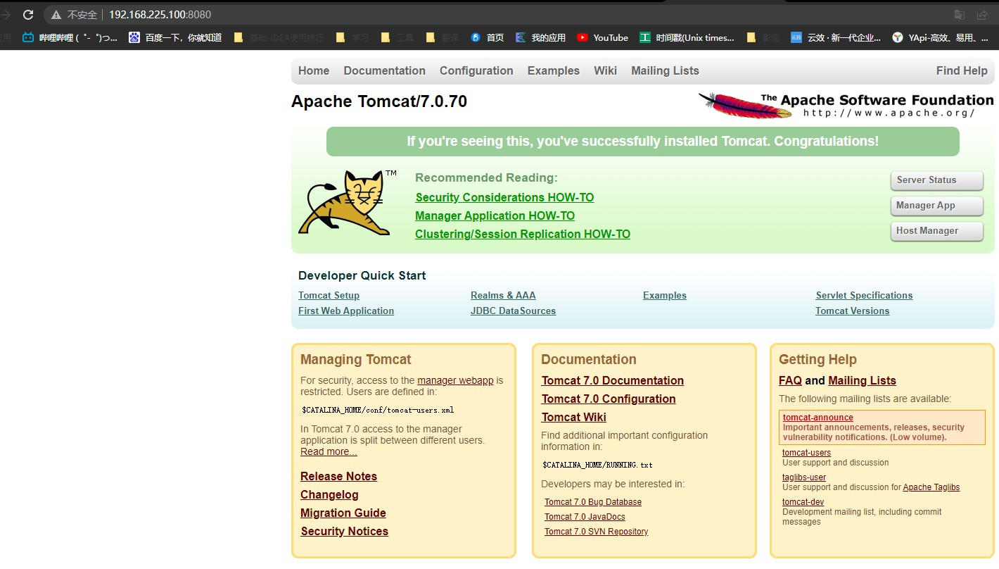
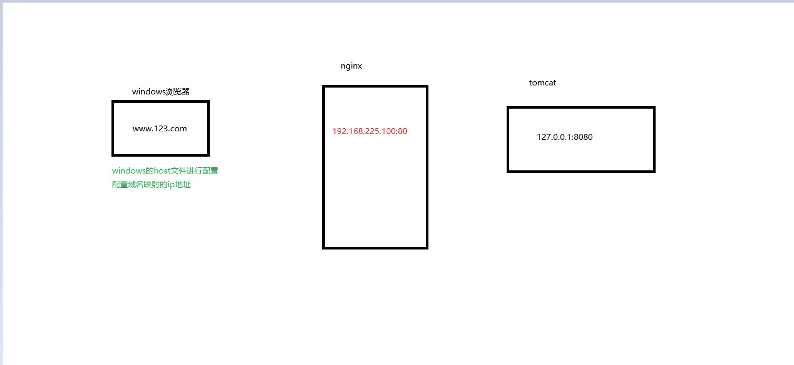
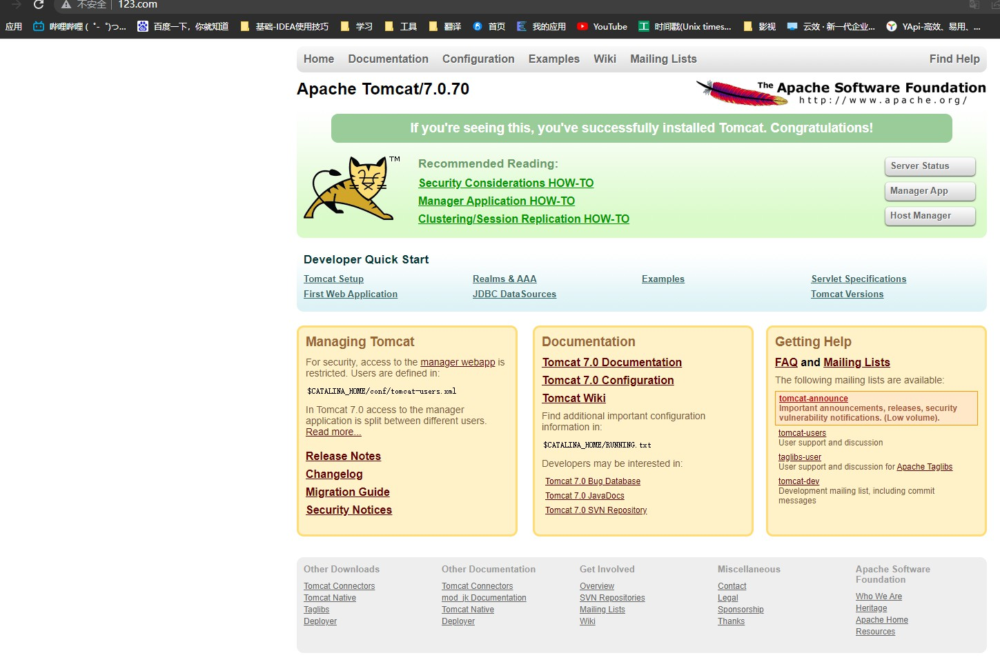

# Nginx
## 概述
Nginx是一个高性能的HTTP和反向代理服务器，特点是占有内存少，并发能力强
### 反向代理
#### 正向代理
在客户端(浏览器)配置代理服务器，通过代理服务器进行互联网访问
#### 反向代理 
反向代理，其实客户端对代理是无知的，因为客户端不需要任何配置就可以访问，只需要将请求发送到反向代理服务器，由反向代理服务器去选择目标服务器获取数据后，在返回给客户端，此时反向代理服务器和目标服务器对外就是一个服务器，暴露的是代理服务器地址，隐藏了真实的服务器IP地址
### 负载均衡
### 动静分离
为了加快网站的解析速度，可以把动态页面和静态页面由不同的服务器来解析，加快解析的速度。降低单个服务器的压力。
## 安装
### 安装pcre
- 联网下载pcre压缩文件依赖
```bash
wget http://downloads.sourceforge.net/project/pcre/pcre/8.37/pcre-8.37.tar.gz
```
- 解压压缩包

```bash
tar -xvf pcre-83.7.tar.gz
```
- 进入安装目录，使用`./configure`配置环境
- 使用`make install`命令安装依赖

这一步可能会提示没有安装gcc，使用`yum install -y gcc gcc-c++`安装

- `pcre-config --version`查看版本号

### 安装openssl,zlib
```bash
yum -y install make zlib zlib-devel gcc-c++ libtool openssl openssl-devel
```
### 安装nginx
安装成功后,usr目录下新增local/nginx,nginx目录下存放启动sbin
> 执行

```bash
./nignx
```
> 开放80端口

`firewall-cmd --list-all`查看开放端口
`sudo firewall-cmd --add-port=80/tcp --permanent`开放80端口
`firewall-cmd --reload`重启防火墙
`ps -ef | grep nginx`查看后台
## nignx常用命令
> 查看版本

`./nginx -v`
> 启动nginx

`./nginx`
> 关闭nginx

`./nginx -s stop`

> 重新加载nginx

`./nignx -s reload`

## nginx配置文件
> 文件位置

```bash
usr/local/nginx/conf
```
> 文件组成

nginx配置文件由三部分组成
- 全局块
    从配置文件到events块之间的内容，主要会设置一些影响nginx服务器整体运行的配置指令，主要包括配置运行nginx服务器的用户（组），允许生成的worker process树，进程PID存放路径，日志存放路径和类型以及配置文件的引入等。
    ```java
    worker_processes  1;
    ```
    这是Nginx服务器并发处理服务的关键配置，worker_processes值越大，可以支持的并发处理量也越多，但是会受到硬件、软件等设备的制约
- events块
```java
events {
    worker_connections  1024;
}
```
events块涉及的指令主要影响Nginx服务器与用户的网络连接，常用的设置包括是否开启多work process下的网络连接进行序列化，是否允许同时接收多个网络连接，选取哪种事件驱动模型来处理连接请求，每个word process可以同时支持的最大连接树等。
上述例子表示每个work process支持的最大连接数为1024,这部分对Nginx的性能影响较大，在实际中应该灵活配置
- http块

Nginx服务器配置中最频繁的部分
http块包括http全局块和server块
## Nginx配置实例-反向代理
- 实现效果：打开浏览器，在浏览器地址栏输入地址www.123.com,跳转linux系统tomcat主页面中
- 准备工作
  - 在Linux系统中安装tomcat，使用默认的80端口
  - 解压tar -xvf apache-tomcat-7.x.tai.gz
  - 进入tomcat的bin目录，./start.sh启动tomcat服务器
  - 对外开放访问的端口
  - 浏览器访问http://192.168.225.100:8080/
  
  
- 具体配置
  - 在windows系统的host文件中进行域名和ip对应关系的配置
```java
192.168.225.100 www.123.com
```
  -在nginx配置文件中配置
  ```java
//修改server开中的server_name
server_name  192.168.225.100
//在location块中添加
 proxy_pass http://127.0.0.1:8080;
  ```

  重启nginx,启动tomcat,访问www.123.com
  
  ## Nginx配置实例-反向代理2
  > 实现效果：使用nginx反向代理，根据访问的路径跳转到不同的端口的服务中,nginx监听端口为9001

  > 访问http://127.0.0.1:9001/edu/直接跳转到127.0.0.1:8080
  访问http://127.0.0.1:9001/vod/直接跳转到127.0.0.1:8081

- 在src目录下新建tomcat8080,tomcat8081目录，目录中放两个tomcat，修改其中一个端口号，防止端口号冲突，分别启动
- 