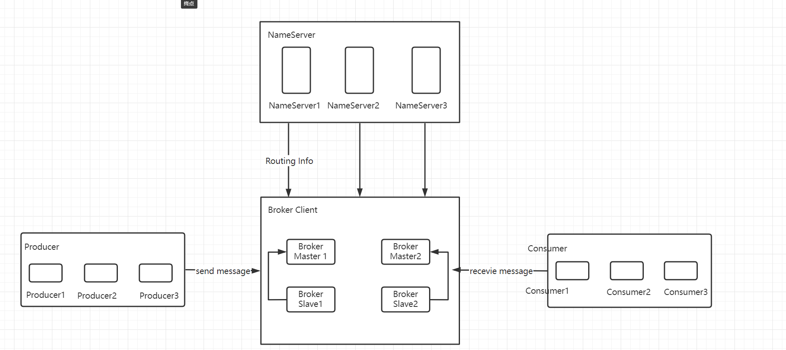
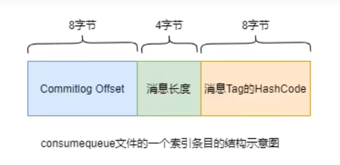

# RocketMQ

## 基本概念

### 1. 消息(Message)

消息是指，消息系统所传输的物理载体，生产和消费数据的最小单位，每条消息必须属于一个主题(topic)。

### 2. 主题(Topic)

> topic:message 1:n
>
> message:topic 1:1

Topic表示一类消息的集合，每个topic包含若干条消息，每条消息只能属于一个Topic,是RocketMQ进行消息订阅的基本单位。

> producer:topic  1:n
>
> consumer:topic 1:1

一个生产者可以同时发送多种Topic消息；而一个消费者只对某种特定的Topic感兴趣，即只可以订阅和消费一种Topic的消息。

### 3. 标签(Tag)

为消息设置的标签，用于同一主题下区分不同类型的消息。来自同一业务单元的消息，可以根据不同业务目的在同一主题下设置不同标签。标签能够有效地保持代码的清晰度和连贯性，并优化RocketMQ提供的查询系统。消费者可以根据Tag实现对不同子主题的不同消费逻辑，实现更好的拓展性。

### 4. 队列(Queue)

存储消息的物理实体。一个Topic中可以包含多个Queue，每个Queue中存放的就是该Topic的消息。一个Topic的Queue也被称为一个Topic中消息的分区

### 5. 消息标识(MessageId/Key)

RocketMQ中每个消息拥有唯一的MessageId, 且可以携带业务标识的key, 以方便对消息的查询。不过需要注意的是，MessageId有两个：在生产者send()消息时会自动生成一个MessageId(msgId)，当消息到达Broker后，Broker也会自动生成一个MessageId(offsetMsgId)。msgId和offsetMsgId都称为消息标识。

- msgId：由producer端生成，其生成规则为：

​	producerIp + 进程pid + MessageClientSetter类的ClassLoader的hashCode + 当前时间 + AutomicInteger自增计数器

- offsetMsgId：由Broker端生成，其规则为:brokerIp + 物理分区的offset
- key：由用户指定的业务相关的唯一标识


## 系统架构

RocketMQ架构上主要分为四部分构成：

### 1.Producer

消息生产者，负责生产消息。Producer通过MQ的负载均衡模块选择相应的Broker集群队列进行消息投递，投递的过程支持快速失败并且低延迟。

RocketMQ中的消息生产者都是以生产者组(Producer Group)的形式出现的。生产者组是同一类生产者的集合，这类Producer发送相同的Topic类型的消息。

一个生产者组可以同时发送多个主题的消息。

### 2.Consumer

消息消费者，负责消费消息。一个消息消费者会从Broker服务器中获取到消息，并对消息进行相关业务处理。RocketMQ中的消息消费者都是以消费者组(Consumer Group)的形式出现的。消费者组是同一类消费者的集合，这类Consumer消费的同一个Topic类型的消息。消费者组使得在消息消费方面，实现负载均衡和容错的目标变得非常容易。

消费组中Consumer的数量应该小于等于订阅Topic的Queue数量。如果超过Queue数量，则多出的Consumer将不能消费消息。

消费组中的消费者可以同时消费多个Queue,一个主题中的Queue只能被一个Consumer消费

### 3.Name Server

NameServer是一个Broker与Topic路由的注册中心，支持Broker的动态注册与发现。

主要包括两个功能：

- **Broker管理**：接受Broker集群的注册信息并且保存下来作为路由信息的基本数据；提供心跳检测机制，检查Broker是否存活。
- **路由信息管理**：每个NameServer中都保存着Broker集群的整个路由信息和用户客户端查询的队列信息。Producer和Consumer通过NameServer可以获取整个Broker集群的路由信息，从而信息消息的投递和消费。

#### 路由注册

NameServer通常是以集群的方式部署，NameServer是无状态的，即NameServer集群中的各个节点间是无差异的，各节点间相互不进行信息通讯。在Broker节点启动时，轮询NameServer列表，与每个NameServer节点建立长连接，发起注册请求。在NameServer内部维护一个Broker列表，用来动态存储Broker的信息。Broker节点为了证明自己alive状态，为了维护与NameServer的长连接，会将最新的信息以心跳包的方式上报给NameServer，每30秒发送一次心跳。心跳包括BrokerId,Broker地址,Broker名称，Broker所属集群名称等等。NamerServer在接收到心跳包后，会更新心跳时间戳，记录这个Broker的最新存活时间。

> NameServer无状态方式，有什么优缺点：
>
> 优点：NameServer集群搭建简单，扩容简单
>
> 缺点：对于Broker，必须明确指出所有NameServer地址。否则未指出的将不会去注册。正因为如初，NameServer并不能随便扩容。Broker不重新配置，新增的NameServer对于Broker来说是不可见的，其不会向这个NameServer进行注册。

#### 路由剔除

由于Broker关机，宕机或网络抖动等原因，NameServer没有收到Broker心跳，NameServer可能会将其从Broker列表中剔除。NameServer中有一个定时任务，每隔10秒就会扫描一次Broker列表，查看每个Broker的最新心跳时间戳距离当前时间是否超过120秒，如果超过，则会判定Broker失效，然后将其从Broker列表中剔除。

#### 路由发现

RockerMQ的路由发现采用的是Pull模型。当Topic路由信息出现变化时，NameServer不会主动推送给客户端，而是客户端定时拉取主题最新的路由。默认客户端每30秒会拉取一次最新的路由。

> push模型：推送模型。实时性较好，是一个“发布-订阅”模型，需要维护一个长连接。而长连接的维护是需要成本的。
>
> pull模型：拉取模型。实时性较差。

#### 客户端NameServer选择策略

> Producer与Consumer

客户端在配置时必须填写NameServer集群地址，客户端在连接NameServer节点时首先随机数，然后在与NameServer节点数量取模，此时得到的就是所要连接节点的索引，然后进行连接。如果连接失败，则会采用round-robin策略，逐个尝试去连接其他节点。

首先采用的是`随机策略`进行选择，失败后采用`轮询策略`

### 4.Broker

#### 功能介绍

Broker充当着消息中转的角色，负责存储消息、转发消息。Broker在RocketMQ系统中负责接收并存储从生产者发送来的消息，同时为消费者的拉取请求作准备。Broker同时也存储着消息相关的元数据，包括消费者组进度偏移offset、主题、队列等。


==Remote Module==：整个Broker的实体，负责处理来自clients端的请求。而这个Broker实体则由以下模块构成。

`Client Manager`：客户端管理器。负责接收、解析客户端(Producer/Consumer)请求，管理客户端。例如，维护Consumer的Topic订阅消息。

`Stroe Service`：存储服务。提供方便简单的API接口，处理消息存储到物理硬盘和消息查询功能。

`HA Service`：高可用服务，提供Master Broker和Slave Broker之间的数据同步功能。

`Index Service`：索引服务。根据特定的Message key,对投递到Broker的消息进行索引服务，同时也提供根据Message Key对消息进行快速查询的功能。

#### 集群部署



为了增强Broker性能与吞吐量，Broker一般都是以集群的形式出现的。各集群节点中可能存放着相同Topic的不同Queue。Broker节点集群是一个主从集群，即集群中具有master和slave两种角色。Master负责处理读写操作请求，而slave负责读操作请求。一个Master可以包含多个Slave，但是一个slave只能属于一个Master。Master和Slave的对应关系是通过指定相同的BrokerName、不同的BrokerId来确定的。BrokerId为0表示Master，非0表示Slave。每个Master和Slave集群中的所有节点建立长连接，定时注册Topic信息到所有NameServer。 

### 5.工作流程

#### 具体流程

- 启动NameServer，NameServer启动后开始监听端口，等待Broker、Producer、Consumer链接。
- 启动Broker时，Broker会与所有的NameServer建立长连接，然后每30秒向NameServer发送心跳包
- 收发消息前，可以先创建Topic，创建Topic时需要指定该Topic要存储在哪些Broker上，当然，在创建Topic时也会将Topic与Broker的关系写入到NameServer中。这一步是可选的，也可以在发送消息时自动创建Topic。
- Producer发送消息，启动先跟NameServer集群中的其中一台建立长连接，并从NameServer中获取路由信息，即当前发送的Topic的Queue与Broker的地址(IP+Port)的映射关系。然后根据算法策略从队列中选择一个Queue，与队列所在的Broker建立长连接从而向Broker发送消息。在获取到路由信息后，Producer会首先将路由信息缓存到本地，在每30秒从NameServer更新一次路由信息。
- Consumer和Producer类似，跟其中一台NameServer建立长连接，获取其所订阅的Topic的路由信息，然后根据算法策略从路由信息中获取到其所要的Queue,然后直接跟Broker建立长连接，开始消费其中的消息。Consumer在获取到路由信息后，同样也会每30秒从NameServer更新一次路由信息。不同于Producer，Consumer还会向Broker发送心跳，以确保Broker存活状

#### Topic的创建模式

Topic的创建方式有两种模式：

**集群模式**：该模式下创建的Topic在该集群中，所有Broker中的Queue数量是相同的。
**Broker模式**：该模式下创建的Topic在该集群中，每个Broker中的Queue数量可以不同。

自动创建Topic时，默认采用的是Broker模式，会为每个Broker默认创建4个Queue

#### 读/写队列

从物理上来讲，读/写队列是同一个队列。所以，不存在读/写队列数据同步问题，读/写队列是逻辑上进行区分的概念。一般情况下，读写队列的数量是相同的。

例如，创建Topic时设置的写队列数量为8，读队列为4，此时系统会创建8个Queue，分别是0-7。Producer会将消息写入到这8个队列中，但Consumer只会消费0123这4个队列中的消息，4567中的消息不会被消费到。

在例如，创建Topic时设置的写队列数量为4，读队列为8，此时系统会创建8个Queue，分别是0-7。Producer会将消息写入到这0123这4个队列中，但Consumer只会消费8个队列中的消息，4567中不存在消息。此时假设ConsumerGroup中包含两个Consumer,Consumer1消费0123，而Consumer2消费4567.但是实际上，Consumer2没有消息可以消费。

> 设计目的

例如，原来创建的Topic中包含16个Queue，如何能够使其Queue缩容为8个，还不会丢失消息？可以动态修改写队列数据为8，读队列数量不变。此时新消息只能写入8个队列，而消费的是16个队列。当发现后8个Queue中的数据消费完毕后，就可以把读队列中的Queue数量设置为16.整个过程，没有丢失任何消息。

## 安装与启动

### 1.安装

官网安装教程https://rocketmq.apache.org/docs/quick-start/

> 解压安装

```bash
  > unzip rocketmq-all-4.9.4-source-release.zip
  > cd rocketmq-all-4.9.4-source-release/
  > mvn -Prelease-all -DskipTests clean install -U
  > cd distribution/target/rocketmq-4.9.4/rocketmq-4.9.4
```

#### 修改初始内存

修改`runserver.sh`和`runbroker.sh`,更改`-Xms`相关参数

#### 启动

> Start Name Server

```bash
  > nohup sh bin/mqnamesrv &
  > tail -f ~/logs/rocketmqlogs/namesrv.log
  The Name Server boot success...
```

> Start Broker

```bash
  > nohup sh bin/mqbroker -n localhost:9876 &
  > tail -f ~/logs/rocketmqlogs/broker.log 
  The broker[%s, 172.30.30.233:10911] boot success...
```

> 发送接收消息

--来自官网：Before sending/receiving messages, we need to tell clients the location of name servers. RocketMQ provides multiple ways to achieve this. For simplicity, we use environment variable `NAMESRV_ADDR`

```bash
 > export NAMESRV_ADDR=localhost:9876
 > sh bin/tools.sh org.apache.rocketmq.example.quickstart.Producer
 SendResult [sendStatus=SEND_OK, msgId= ...

 > sh bin/tools.sh org.apache.rocketmq.example.quickstart.Consumer
 ConsumeMessageThread_%d Receive New Messages: [MessageExt...
```

> 关闭 Servers

```bash
> sh bin/mqshutdown broker
The mqbroker(36695) is running...
Send shutdown request to mqbroker(36695) OK

> sh bin/mqshutdown namesrv
The mqnamesrv(36664) is running...
Send shutdown request to mqnamesrv(36664) OK
```

## 集群搭建

### 1.数据复制与刷盘策略

#### 复制策略

复制策略是Broker的Master与Slave之间的数据同步方式。分为同步复制与异步复制：

- 同步复制：消息写入master后，master会等待slave同步数据成功后才向producer返回成功ACK
- 异步复制：消息写入master后，master会立即向producer返回成功ACK，不需要等待slave同步数据成功

> 异步复制会降低系统的写入延迟，RT变小，提高了系统的吞吐量

#### 刷盘策略

刷盘策略指的是broker中消息的`落盘`方式，即消息发送到broker内存后消息持久化到磁盘的方式。分为同步刷盘和异步刷盘：

- 同步刷盘：当消息持久化到broker的磁盘后才算是消息写入成功
- 异步刷盘：当消息写入到broker的内存后即表示消息写入成功，无需等待消息持久化到磁盘

> 消息写入到Broker的内存，一般是写入到PageCache
>
> 对于异步刷盘策略，消息会写入到PageCache后会立即返回成功ACK。但是不会立即做落盘操作，而是当PageCache到达一定量时会自动进行落盘。

### 2.Broker集群模式

#### 单Master

只有一个Master（本质上不能称为集群）。这种方式只能在测试时使用，生产环境下不能使用，因为存在单点问题。

#### 多Master

broker集群仅由多个master构成，不存在slave。同一Topic的各个Queue会分布在各个master节点上。

- 优点：配置简单，单个Master宕机或重启维护对应用无影响，在磁盘配置为RAID10时，即使机器宕机不可恢复的情况下，由于RAID10磁盘非常可靠，消息与不会丢失（异步磁盘丢失少量消息，同步磁盘不丢失消息），性能最高
- 缺点：单台机器宕机期间，这台机器上未被消费的消息在机器恢复之前不可订阅（不可消费），消息实时性会受到影响。

#### 多Master多Slave模式-异步复制

broker集群由多个master构成，每个master又配置了多个slave（在配置了RAID磁盘阵列的情况下，一个master一般配置一个slave即可）。master与slave的关系是主备关系，即master负责处理消息的读写请求，而slave仅负责消息的备份与master宕机后的角色切换。

异步复制即前面所说的`复制策略`中的`异步复制策略`，即消息写入master成功后，master立即向producer返回成功ACK，无需等待slave同步数据成功。

该模式的最大特点之一是，当master宕机后slave能够`自动切换为master`。不过由于slave从master的同步具有短暂的延迟（毫秒级），所以宕机后，这种异步复制方式可能会存在少量消息的丢失问题。

#### 多Master多Slave模式-同步双写

该模式是`多Master多Slave模式`的同步复制实现。同步双写，指的是消息写入master成功后， master会等待slave同步数据成功后才向producer返回成功ACK，即master与slave都要写入成功后才会返回ACK，即双写。

该模式与异步复制模式相比，优点是消息的安全性更高，不存在消息丢失的情况。但单个消息的RT略高，从而导致性能降低（大约低10%）

该模式存在一个大的问题：对于目前的版本，Master宕机后，Slave`不会自动切换`到Master。

####  最佳实践

一般会为master配置RAID10阵列，然后在为其配置一个slave。即利用了RAID10磁盘阵列的高效、安全性，又解决了可能会影响订阅的问题。

> - 多Master+RAID阵列，其仅仅可以保证数据不丢失，即不影响消息写入，但其可能会影响到消息的订阅。执行效率要远高于`多Master多Slave集群`
> - 多Mstere多Slave集群，其不仅可以保证数据不丢失，也不会影响消息写入。执行效率要低于`多Master+RAID阵列`

## 实践

### 配置文件位置

`conf/2m-2s-async`

### rocketmqOS1,修改os1配置文件

#### 修改broker-a.properties

```bash
# 指定整个broker集群的名称
brokerClusterName=DefaultCluster

# 指定master-slave集群的名称。一个RockerMQ集群可以包含多个master-slave集群
brokerName=broker-a

# master的brokerId为0
brokerId=0

# 指定删除消息存储过期文件的时间为凌晨4点
deletewhen=04

# 指定未发生更新的消息存储文件的保留时长为48小时，48小时后过期，将会被删除
fileReserverTime=48

# 指定当前broker为异步复制master
brokerRole=ASYNC_MASTER

# 指定刷盘策略为异步刷盘
flushDiskType=ASYNC_FLUSH

# 指定NamerServer的地址（这里需要手动添加）
namesrvAddr=192.168.59.164:9876;192.168.59.165:9876
```

#### 修改broker-b-s.properties

将该配置文件内容修改为如下：

```bash
brokerClusterName=DefaultCluster
# 指定这是另外一个master-slave集群
brokerName=broker-b

# slave的brokerId为非0
brokerId=1
deleteWhen=04
fileReservedTime=48
# 指定当前broker为slave
brokerRole=SLAVE
flusDiskType=ASYNC_FLUSH

# 手动添加
namesrvAddr=192.168.59.164:9876;192.168.59.165:9876

# 指定broker对外提供服务的端口，即Broker与producer和consumer通信的接口，默认10911.由于当前主机同时充当master1与slave2,而前面的master1使用的是默认端口。这里需要将这两个端口加以区分，区分出master1与slave2
listenPort=11911

# 指定消息存储相关的路径。默认路径为~/store目录。由于当前主机同时充当master1和slave2，master1使用的是默认路径，这里需要指定一个不同的路径
storePathRootDir=~/store-s
storePathCommitLog=~/store-s/commitLog
storePathConsumerQueue=~/store-s/consumequeue
storePathIndex=~/store-s/index
storeCheckpoint=~/store-s/checkpoint
abortFile=~/store-s/abort
```

### rocketmqOS2,修改os2配置文件

#### 修改broker-b.properties

内容同上

#### 修改broker-a-s.properties

内容同上

### 启动服务器

#### 启动NameServer集群

分别启动rocketmqOS1和rocketmqOS2两个主机中的NameServer。启动命令相同

```bash
nohup sh bin/mqnamesrv &
```

#### 启动两个Master

分别启动rocketmqOS1和rocketmqOS2两个主机中的broker master。它们指定要加载的配置文件是`不同的`。

```bash
nohup sh bin/mqbroker -c conf/2m-2s-async/broker-a.properties &
```

```bash
nohup sh bin/mqbroker -c conf/2m-2s-async/broker-b.properties &
```

#### 启动两个Slave

```bash
nohup sh bin/mqbroker -c conf/2m-2s-async/broker-a-s.properties &
```

```bash
nohup sh bin/mqbroker -c conf/2m-2s-async/broker-b-s.properties &
```

## RocketMQ工作原理

### 消息的生产

#### 消息的生产过程

Producer可以将消息写入到某个Broker中的某个Queue中，其经历了如下过程：

- Producer发送消息之前，会先向NameServer发出`获取消息Topic的路由信息`的请求
- NameServer返回该Topic的`路由表`及`Broker列表`
- Producer根据代码中指定的Queue选择策略，从Queue列表中选出一个队列，用于后续存储消息
- Producer对消息做一些特殊处理，例如，消息本体超过4M，则会对其进行压缩
- Producer向选择出的Queue所在的Broker发出RPC请求，将消息发送到选择的Queue

NameServer维护的路由表，实际上是一个Map,key为Topic名称，value是一个QueueData实例集合，而一个QueueData则包含一个Broker实例的所有此Topic的Queue信息，即一个Broker对应一个QueueData，QueueData包含brokerName。

```json
{

    "TopicTest":[

        {

            "brokerName":"broker-a",

            "perm":6,

            "readQueueNums":4,

            "topicSynFlag":0,

            "writeQueueNums":4

        }

    ]}
```

> broker列表

其实际上也是一个Map。key为brokerName,value为BrokerData。一个BrokerData对应一组brokerName相同的Master-Slave小集群。BrokerData中包含brokerName及一个map。该map的key为brokerId,value为该broker对应的地址。brokerId为0表示该broker为Master，非0表示Slave.

```json
{

    "broker-a":{

        "brokerAddrs":{

            "0":"172.16.62.75:10911  

        },

        "brokerName":"broker-a",

        "cluster":"DefaultCluster"

    }}

```

#### Queue选择算法

对于无序消息，其Queue选择算法，也称为消息投递算法：

> 轮询算法

默认选择算法。该算法保证了每个Queue中可以均匀的获取消息。

问题：由于某些原因，在某些Broker上的Queue可能投递延迟严重。从而导致Producer的缓存队列中出现大量的消息积压，影响消息的投递性能.

> 最小投递算法

该算法会统计每次消息投递的时间延迟，然后根据统计的结果将消息投递到时间最小的Queue。如果延迟相同，则采用轮询算法投递。

问题：消息在Queue上的分配不均匀。投递延迟小的Queue其可能存在大量的消息。而对该Queue的消费者压力会增大，降低消费的消费能力。

### 消息的存储

#### 目录与文件


- abort:该文件在Broker启动后自动创建，正常关闭Broker，该文件会自动消失。若在没有启动Broker的情况下，发现这个文件是存在的，说明有Broker没有正常关闭。

- checkpoint:其中存储着commitlog、consumequeue、index文件的最后刷盘时间

- commitlog:其中存放commitlog文件

- config:存放Broker运行期间的一些配置数据

- consumequeue:存放consumequeue文件、队列就存放在这个目录中

- index:其中存放着消息索引文件indexFile

- lock:运行期间使用到的全局资源锁

#### 消息单元

commitlog目录中存放着mappedFile文件，当前broker中的所有消息都是被刷盘到了这个commitLog目录中的mappedFile文件。mappedFile文件的大小为1g,文件名由20位十进制数构成，表示当前文件的第一条消息的起始位移偏移量。一个Broker中仅包含一个commitlog目录，所有的mappedFile文件都是存放在该目录中。即无论当前Broker中存放着多少Topic的消息，这些消息都是被顺序写入到了mappedFile文件中。也就是说，这些消息在Broker中存放时并没有被按照Topic进行分类存放。


mappedFile文件内容由一个个的消息单元构成。每个消息单元中包含消息总长度MsgLen、消息的物理位置PhysicalOffset、消息体body，消息体长度bodyLength，消息主题Topic，Topic长度TopicLength，消息生产者BornHost，消息发送时间戳BornTimeStamp，消息所在的队列QueueId，消息在Queue中存储的偏移量QueueOffset等近20余项消息相关属性。

#### consumequeue

 为了提高效率，会为每个Topic在`~/store/consumequeue`中创建一个目录，目录名为Topic名称。在该Topic目录下，会再为每个Topic的Queue建立一个目录，目录名为queueId。每个目录中存放着若干consumequeue文件,consumequeue文件是commitlog的索引文件，可以根据consumequeue定位到具体的消息。

consumequeue文件名也是由20位数字构成，表示当前文件的第一个索引条目的起始位移偏移量。与mappedFile文件名不同的是，其后续文件名是固定的，因为consumequeue文件大小是固定不变的。

#### 索引条目

 

每个consumeque文件可以包含30w个索引条目，每个索引条目包含了三个消息重要属性：消息在mappedFile文件中的偏移量CommitLog Offset、消息长度、消息tag的hashcode值。这三个属性占用20个字节，所以每个文件的大小是固定的30w*20字节。

#### 消息写入

一条消息进入到Broker后经历了以下几个过程才最终被持久化。

- Broker根据queueId,获取到该消息对应索引目录在consumequeue目录中写入偏移量，即QueueOffset
- 将queueId，queueOffset等数据，与消息一起封装为消息单元
- 将消息单元写入到commitLog
- 形成消息索引条目
- 将消息索引条目分发到相应的consumerqueue

#### 消息拉取

当consumer来拉取消息时会经历以下几个步骤：

- Consumer拉取到其要消费的消息所在Queue的==消费偏移量offset==，计算出其要消费的==消息offset==

> 消费offset即消费进度，consumer对某个queue的消费offset，即消费到了该Queue的第几条消息

- Consumer向Broker发送拉取请求，其中会包含其要拉取消费的queue，消息offset及消息Tag
- Broker计算在该consumer的queue中的queueoffset
- 从该queueOffset处开始先后查找第一个指定Tag的索引条目
- 解析该索引条目的前8个字节，即可定位到该消息在commitLog文件中的commit offset
- 从对应commitLog offset中读取消息单元，并发送给Consumer

### indexFile

除了通过通常的指定Topic进行消息消费外，RocketMQ还提供了根据key进行消息查询的功能。该查询是通过store目录中的index目录中的index子目录中的indexFile进行索引实现的快速查询。

#### 索引条目结构

每个Broker中会包含一组indexFile，每个indexFile都是以一个时间戳命名的（indexFile被创建时的时间戳）。每个indexFile文件由三部分组成：indexHeader，slot槽位，indexes索引数据。每个indexFile文件中包含500w个slot槽。而每个slot槽又可能会挂载很多的index索引单元。


- beginTimestamp：该indexFile中第一条消息的存储时间
- endTimestamp：该indexFile中最后一条消息的存储时间
- beginPhyoffset：该indexFile中第一条消息在commitlog中的偏移量commitlog offset
- endPhyoffset：该indexFile中最后一条消息在commitlog中的偏移量commitlog offset
- hashSlotCount：已经填充有index的slot数量
- indexCount：该indexFile中包含的索引个数

####  查询流程

// todo 

### 消息的消费

消费者从Broker中获取消息的方式有两种：Pull拉取方式和push推动方式。消费者组对于消息消费的模式又分为两种：集群消费Clustering和广播消费Broadcasting

#### 获取消费类型

##### 拉取式消费

Consumer主动从Broker中拉取消息，主动权由Consumer控制。一旦获取了批量消息，就会启动消费过程。但是，该方式的实时性较弱，即Broker中有了新的消息时消费者并不能及时发现并消费。

##### 推送式消费

该模式下Broker收到数据后会主动推送给Consumer。该消费模式一般实时性较高

该消费类型是典型的发布-订阅模式，即Consumer向其关联的Queue注册了监听器，一旦发现有新的消息过来就会触发回调的执行，回调方法是Consumer去Queue中拉取消息。而这些都是基于Consumer与Broker的长连接，长连接的维护需要消耗系统资源。

##### 对比

- pull：需要应用去实现对关联Queue的遍历，实时性差；但便于应用控制消息的拉取
- push：封装了对关联Queue的遍历，实时性强，但会占用较多的系统资源

### 消费模式

#### 广播消费

广播消费模式下，相同Consumer Group的每个Consumer实例都接收同一个Topic的全量消息。即每条消息都会发送到Consumer Group中的每个Consumer。

#### 集群消费

集群消费模式下，相同Consumer Group的每个Consumer实例平均分摊同一个Topic的消息。即每条消息只会发送到Comsumer Group中的某个Consumer。

#### 消费进度保存

- 广播模式：消费进度保存在consumer端。因为广播模式下consumer group中每个consumer都会消费所有消息，但他们的消费进度是不同的，所以consumer各自保存各自的消费进度。
- 集群模式：消费进度保存在broker中。consumer group中的所有consumer共同消费同一个Topic中的消息，同一条消息只会被消费一次。消费进度会参与到消费的负载均衡中，所以消费进度是需要共享的。

### Rebalance机制

#### Rebalance

Rebalance即再均衡，指的是将一个Topic下的多个Queue在同一个ConsumerGroup中的多个Consumer间进行重新分配的过程。


Rebalance机制的本意是为了提升消息的并行消费能力。例如，一个Topic下5个队列，在只有1个消费者的情况下，这个消费者将负责消费这5个队列的消息。如果此时我们增加一个消费者，那么就可以给其中一个消费者分配2个队列，给另外一个消费者分配3个队列，从而提升消息的并行消费能力。

#### Rebalance限制

由于一个队列最多分配给一个消费者，因此当某个消费者组下的消费者实例数量大于队列的数量时，多余的消费者实例将分配不到任何队列

#### Rebalance危害

Rebalance在提升消费能力的同时，也带来一些问题：

==消费暂停==：在只有一个Consumer时，其负责消费所有队列；在新增了一个Consumer后会触发Rebalance机制。此时原Consumer就需要暂停部分队列的消费，等到这些队列分配给新的Consumer后，这些暂停消费的队列才能继续被消费

==消费重复==：Consumer在消费新分配给自己的队列时，必须接着之前Consumer提交的消费进度的offset继续消费。然而默认情况下，offset是异步提交的，这个异步性导致提交到Broker的offset与Consumer实际消费的消息不一致。这个不一致的差值可能导致消息重复消费。

> 同步提交：consumer提交了其消费完毕的一批消息的offset给broker后，需要等待broker的成功ACK。当受到ACK后，consumer才会继续获取并消费下一批消息。在等待ACK期间，consumer是阻塞的。
>
> 异步提交：consumer提交了其消费完毕的一批消息的offset给broker后，不需要等待broker的成功ACK。consumer可以直接获取其消费下一批消费

==消费突刺==：由于Rebalance可能导致重复消费，如果需要重复消费的消费过多，或者因为Rebalance暂停时间过长导致积压了部分消息。那么有可能会导致在Rebalance结束之后瞬间需要消费很多消息。

#### Rebalance产生的原因

导致Rebalance产生的原因：消费者订阅的Topic的Queue数量发生变化；消费者组中消费者的数量发生变化（扩容，运维，与NameServer间网络异常）

#### Rebalance过程

在Broker中维护者多个Map集合，这些集合中动态存放着当前Topic中queue的信息，Consumer Group中Consumer实例的消息。一旦发现消费者所订阅的Queue数量发生变化，或消费者组中消费者的数量发生变化，立即向Consumer Group中的每个实例发出Rebalance通知。Consumer实例在接收到通知后会采用Queue分配算法自己获取到对用的Queue，即由Consumer实例自主进行Rebalance。

> TopicConfigManager：key是topic名称，value是TopicConfig。TopicConfig维护着该Topic中所有Queue的数据
>
> ConsumerManager：key是Consumer Group Id，value是ConsumerGroupInfo。ConsumerGroupInfo中维护着该Group中所有的Consumer实例数据
>
> ConsumerOffsetManager：key为`Topic与订阅该Topic的Group的组合`，value是一个内层map。内层map的key为QueueId，内层Map的value为该Queue的消费进度Offset。

### Queue分配算法

一个Topic中的Queue只能由Consumer Group中的一个Consumer消费，而一个Consumer可以同时消费多个Queue中的消息，Queue要分配给哪个Consumer进行消费，也是有算法策略的。常见的有四种策略，这些策略是通过在创建Consumer时的构造器传进去的。

#### 平均分配策略


该算法是要根据avg = QueueCount / ConsumerCount的计算结果进行分配的。如果能够整除，则按顺序将avg个Queue逐个分配给Consumer；如果不能整除，则将多余的Queue按照Consumer顺序逐个分配

#### 环形平均策略


环形平均算法是指，根据消费者的顺序，依次在由Queue队列组成的环形图中逐个分配。

> 该算法不用先计算每个Consumer需要分配几个Queue，直接分配即可

#### 一致性hash策略


该算法会将consumer的hash值作为Node节点存放到hash环上，然后将queue的hash值也放到hash环上，通过顺时针方向，距离queue最近的consumer就是该queue要分配的consumer。

#### 同机房策略


该算法会根据queue部署机房位置和consumer的位置，过滤出当前consumer相同机房的queue。然后按照平均分配策略或环形平均策略对同机房queue进行分配。如果没有同机房queue，则按照平均分配策略或环形平均策略对所有的queue进行分配。

#### 算法对比

两种平均分配策略的分配效率较高，一致性hash策略较低，因为一致性hash算法比较复杂，另外一致性hash策略分配的结果也很大可能上存在分配不均的情况

一致性hash算法存在的意义：其可以有效减少由于消费者组扩容或缩容所带来的大量Rebalance。


一致性hash算法的应用场景：

Consumer数量变化较频繁的场景。

### 至少一次原则

RocketMQ有一个原则：每条消息必须要被成功消费一次。即Consumer在消费完消息后会向其消费进度记录器提交其消费消息的offset，offset被成功记录到记录器中，那么这条消费就被成功消费了

### 订阅关系的一致性

订阅关系的一致性指的是同一个消费者组（GroupId相同）下所有的consumer实例所订阅的Topic与Tag及对消息的处理逻辑必须完全一致。否则，消息消费的逻辑就会混乱，甚至导致消息丢失。

订阅不同topic，订阅相同topic但是tag不同,订阅不同数量的topic

### Offset管理

消费进度Offset是用来记录每个queue的不同消费组的消费进度的。根据消费进度记录器的不同，可以分为两种模式：本地模式和远程模式。

#### offset本地管理模式

当消费模式为广播模式时，offset使用本地模式存储。因为每条消息会被所有的消费者消费，每个消费者管理自己的消费进度，每个消费者之间不存在消费进度的交集。

consumer在广播消费模式下offset相关数据以json的形式持久化到consumer本地磁盘文件中，模式文件路径为当前用户主目录下的`.rocketmq_offsets/${clientId}/${group}/offsets.json`。其中`${clientId}`为当前消费者id，默认为ip@DEFAULT；group为消费者组名称。

#### offset远程管理模式

当消费模式为集群模式时，offset使用远程模式管理。因为所有consumer实例对消息采用的是均衡消费，所有consumer共享queue的消费进度。

consumer在集群消费模式下offset相关数据以json的形式持久化到broker磁盘文件中，文件路径为当前用户主目录下的stroe/config/consumerOffset.json。

broker启动时会加载这个文件，并写入一个双层map。外层map的key为topic@group，value为内层map。内层map的key为queueId，value为offset。当发生Rebalance时，新的consumer会从该map中获取到相应的数据来进行消费。

#### offset用途

当消费完一批消息后，consumer会提交其消费进度offset给Broker，Broker在收到消费进度后会将其更新到双层map(ConsumerOffsetManager)和consumerOfffset.json文件中，然后向该Consumer进行ACK，而ACK内容中包含三项数据：当前消费队列的最小offset(minOffset)，最大offset(maxOffset)，及下次消费的起始offset(nextBeginOffset)

#### 重试队列

当rocketmq对消息的消费出现异常时，会将发生异常的offset提交到Broker中的重试队列。系统在发生消息消费异常时会为当前的topic创建一个重试队列，该队列以`%RETRY%`开头，到达重试时间后进行消费重试。

#### offset提交

集群消费模式下，consumer消费完消息后会向broker提交消费进度offset，其提价方式为两种：

- 同步提交：消费者在消费完一批消息后会向broker提交这些消息的offset，然后等待broker的成功相应。如果在等待超时之前受到了成功响应，则继续读取下一批消息进行消费。若没有受到响应，则会重新提交，知道获取到响应。而在这个过程中，消费者是阻塞的，其严重影响了消费者的吞吐量。
- 异步提交：消费者在消费完一批消息后向broker提交offset，但无需等待Broker的成功响应，可以继续读取并消费下一批消息。这种方式增加了消费者的吞吐量。但需要注意，broker在收到提交的offset后，还是会向消费者进行响应的。

### 消费幂等

当出现消费者对某条消息重复消费的情况时，重复消费的结果与消费一次的结果是相同的，并且多次消费并未对业务系统产生任何负面影响，那么这个消费过程就是消费幂等的。

> 幂等：若某操作执行多次与执行一次对系统产生的影响是相同的，则该操作就是幂等的

#### 消费重复场景

##### 发送时消息重复

当一条消息已被成功发送到Broker并完成持久化，此时出现了网络闪断，从而导致broker对Producer应答失败。如果此时producer

意识到消息发送失败并尝试再次发送消息，此时broker中就可能会出现两条内容相同并且messageId也相同的消息，那么consumer也会消费两次。

##### 消费时消息重复

消息已投递到consumer并完成业务处理，当consumer给broker反馈应答时网络闪断，broker没有接收到消费成功响应。为了保证消息至少被消费一次原则，broker将在网络恢复后再次尝试投递之前已被处理过的消息。此时消费者会收到之前处理过的内容相同，messageId也相同的消息。

##### Rebalance时消息重复

当触发Rebalance，此时consumer可能会收到曾经被消费过的消息

#### 解决方案

幂等解决方案的设计中涉及到两项要素：幂等令牌，与唯一性处理。

- 幂等令牌：生产者和消费者两者中的既定协议，通常指具备唯一业务标识的字符串。例如，订单号、流水号。一般由producer随着消息一同发送。
- 唯一性处理：服务端通过采用一定的算法策略，保证同一个业务逻辑不会被重复执行成功多次。例如，对同一笔订单的多次支付操作，只会成功一次。

对于常见的系统，幂等性操作的通用解决方案是：

1.首先通过缓存去重。在缓存中如果已经存在了某幂等令牌，则说明本次操作是重复性操作；若缓存没有命中，则进行下一步。

2.在唯一性处理之前，先在数据库中查询幂等令牌作为索引的数据是否存在。若存在，则说明本次操作为重复性操作；若不存在，则进入下一步。

3.在同一事务中完成三项操作：唯一性处理后，将幂等令牌写入到缓存，并将幂等令牌作为唯一索引的数据写入到DB中。

#### 解决方案举例

以支付场景为例：

- 当支付请求到达后，首先在redis缓存中获取key为支付流水号的缓存value。若value不为空，则说明本次支付是重复操作，业务系统直接返回调用侧重复支付标志；若value为空，则进行下一步操作
- 到DBMS中根据支付流水号查询是否存在实例。若存在，则说明本次支付是重复操作，业务系统直接返回调用侧重复支付标识；若不存在，则说明本次操作是首次操作，进入下一步完成唯一性处理
- 在分布式事务中完成三项操作
  - 完成支付任务
  - 将当前支付流水号作为key，任意字符串作为value，将数据写入redis缓存
  - 将当前支付流水号作为主键，与其他相关数据写入DBMS

#### 消费幂等的实现

消费幂等的解决方案：为消息指定不会重复的唯一标识。因为MessageId有可能重复，所以真正安全的幂等处理，不建议以messageId作为处理依据。最好的方式是以业务唯一标识作为幂等处理的关键依据，而业务的唯一标识可以通过消息key设置

### 消息堆积与消费延迟

消息处理过程中，如果consumer的消费速度跟不上Producer的发送速度，MQ中未处理的消息会越来越多，这部分消息就被称为堆积消息。消息出现堆积进而造成消息的消费延迟。以下场景需要重点关注消息堆积和消费延迟的问题:

- 业务系统上下游能力不匹配导致的消息堆积，且无法自行恢复
- 业务系统对消息的消费实时性要求较高，即使是短暂的堆积造成的消息延迟也无法接受

#### 产生原因

Consumer使用长轮询Pull模式消息消息时，分为以下两个阶段：

> 消费拉取

cosumer通过长轮询Pull模式批量获取消息，将拉取到的消息缓存到本地缓冲队列中。对于拉取消费，在内网环境下会有很高的吞吐量，所以这个阶段一般不会称为消息堆积的瓶颈

> 消息消费

consumer将本地缓存的消息提交到消费线程中，使用业务消费逻辑对消息进行处理，处理完毕后获取到一个结果，这是真正的消费过程，此时consumer消费能力完全取决于消息的消费耗时和消费并发度。如果业务处理逻辑复杂，导致处理单条消息的耗时较长，则整体的消息吞吐量都受到影响，此时导致consumer本地缓冲队列达到上限，停止从服务端拉取消息。

#### 消费并发度

一般情况下，消费者端的消费并发度由单节点线程数和节点数量共同决定，其值为单节点线程数*节点数量。

单节点线程数，即单个consumer所包含的线程数量

节点数量，即consumer group所包含的consumer数量

对于普通消息、延时消息和事务消息，并发度计算都是单节点线程数*节点数量。但是对于顺序消息则是不同的，顺序消息的消费并发度等于topic的queue分区数量。

- 全局顺序消息：该类型消息的topic只有一个queue分区，其可以保证该topic的所有消息被顺序消费。为了保证全局顺序，consumer group中在同一时刻只能有一个consumer的一个线程进行消费，所以其并发度为1
- 分区顺序消息：该类型消息的topic有多个queue分区。其仅可以保证该topic中的每个queue分区中的消息是顺序消费，不能保证整个topic消息中的消息顺序消费。为了保证分区顺序性，每个queue分区中的消息在consumer group中的同一时刻只能有一个consuner的一个线程消费。在同一时刻最多出现多个queue分区由多个consumer的多个线程并行消费，所以其并发度为topic的分区数量。

### 消息的清理

消息是被顺序存储在commitlog文件中，且消息大小不定长，所以消息的清理不会以消息为单位，而是以commitlog文件为单位进行清理

## RocketMQ应用

### 普通消息

> 同步发送

同步发送是指消息发送方发出一条消息后，会在收到服务端同步响应之后才发下一条消息的通讯方式。

此种方式应用场景非常广泛，例如重要通知邮件、报名短信通知、营销短信系统等。


> 异步发送

异步发送是指发送方发出一条消息后，不等服务端返回响应，接着发送下一条消息的通讯方式。消息队列RocketMQ版的异步发送，需要您实现异步发送回调接口（SendCallback）。消息发送方在发送了一条消息后，不需要等待服务端响应即可发送第二条消息。发送方通过回调接口接收服务端响应，并处理响应结果。

异步发送一般用于链路耗时较长，对响应时间较为敏感的业务场景，例如，您视频上传后通知启动转码服务，转码完成后通知推送转码结果等。


> 单向发送

发送方只负责发送消息，不等待服务端返回响应且没有回调函数触发，即只发送请求不等待应答。此方式发送消息的过程耗时非常短，一般在微秒级别

适用于某些耗时非常短，但对可靠性要求并不高的场景，例如日志收集


### 顺序消息

顺序消息指的是，严格按照消息的发送顺序进行消费的消息。

默认情况下生产者会把消息以轮询方式发送到不同queue分区队列；而消费消息时会从多个queue上拉取消息，这种情况下的发送和消费是不能保证顺序的。如果将消息仅发送到一个同一个queue中，消费时也只从这个queue上拉取消息，严格保证了消息的顺序性

#### 作用

例如，现在有topic(order_status)订单状态，其有4个队列，该topic中的不同消息用于描述当前订单的不同状态。假设订单状态有：未支付，已支付，发货中，发货成功，发货失败

根据以上订单状态，生产者从时序上可以生成如下几个消息：

订单t001未支付-->订单t01已支付-->订单t01发货中-->订单t01发货失败


这种情况下，我们希望consumer消费消息的顺序和producer发送是一致的，然而上述mq的投递和消费方式，我们无法保证顺序是正确的。对于顺序异常的消息，consumer即使设置一定的状态容错，也不能完全处理好多种随机出现的组合情况。


基于上述的情况，可以设计如下方案：对于相同订单号的消息，通过一定的策略，将其放置在一个queue中，然后消费者在采用一定的策略（例如，一个线程独立处理一个queue，保证消息的顺序性），能够保证消息的顺序性。

#### 有序性分类

> 全局有序

当发送和消费参与的queue只有一个时所保证的是整个topic中消息的顺序，称为全局有序。（代码中指定，控制台创建）

> 分区有序

如果有多个queue参与，其仅可以保证在该queue分区队列上的消息顺序，则称为分区有序

在定义producer时指定消息队列选择器，选择器是实现MessageQueueSelector接口定义，在定义选择器的选择算法时，一般需要使用选择key。这个选择key可以是消息key也可以是其他数据，但无论谁做选择key，都不能重复，都是唯一。

一般性的选择算法是，让选择key(或其hash值)与该topic所包含的queue的数量取模，其结果即为选择出的queue的queueId。但是取模算法存在问题：不同选择key与queue数量取模结果可能是相同的，即不同选择key的消息可能会出现在相同的queue,即同一个consumer可能会消费到不同选择key的消息。一般性的做法是，从消息中获取Key，对其进行判断，如果是当前consumer需要消费的消息，则直接消费，否则，什么也不做。

### 延时消息

当消息写入broker后，在指定的时长后才可以被消费处理的消息，称为延时消息

#### 延时等级

新版rokcetmq已经支持任意时间（时间戳方式）

延时消息的延迟时长不支持随意时长的延迟，是通过特定的延迟等级来指定的。延时等级定义在rocketmq服务端(Linux服务器)的messageStroreConfig类类中的变量


若指定的延时等级为3，则表示延迟时长为10s，即延迟等级是从1开始的

### 事务消息

> 问题引入

需求场景：工行用户A向建行用户B转账1万元


1.工行系统发送一个给B增款1万元的同步消息M给broker

2.消息被broker成功接收后，向工行系统发送成功ACK

3.工行系统受到成功ACK后从用户A中扣款1万元

4.建行系统从broker中获取到消息M

5.建行系统消费消息M，即向用户B中增加1万元

#### 解决思路

让第1，2，3步具有原子性，要么全部成功，要么全部失败，即消息发送成功后，必须要保证扣款成功。如果扣款失败，则回滚发送成功的消息，即事务消息


使用事务消息来处理该需求场景：

1.事务管理器TM向事务协调器TC发起指令，开启全局事务

2.工行系统发一个给B增款1万元的事务消息M给TC

3.TC会向broker发送半事务消息prepareHalf，将消息M预提交到broker。此时的建行系统是看不到broker中的消息M的

4.broker会将预提交执行结果report给TC

5.如果预提交失败，则TC会向工行系统发送消息M提交失败的响应，全局事务结束；如果预提交成功，TC会调用工行系统的回调操作，去完成工行用户A的预扣款1万元操作

6.工行系统会向TC发送预扣款执行结果，即本地事务的执行状态

7.TC收到预扣款执行结果后，会将结果上报给TM

8.TM会根据上报结果向TC发出不同的确认指令

- 若预扣款成功，则TM向TC发送global commit指令
- 若预扣款失败，则TM向TC发送global rollback指令
- 若出现未知状态，则会触发工行系统的本地事务状态回查操作。回查结果会将回查结果，commitMessage或rollbackMessage报告给TC。TC将结果上报给TM，TM会向TC发送最终确认指令golbal commit或者global rollback

9.TC在接收到指令后会向broker与工行系统发出确认指令

- TC接收的若是global commit指令，则向broker与工行系统发送branch commit指令。此时broker中的消息M才能被建行系统看到，此时工行用户A中的扣款操作才真正被确认
- TC接收到的若是global rollback指令，则向broker与工行系统发送branch rollback指令。此时broker中的消息M将被撤销；工行用户A中的扣款操作将被回滚

#### 基础

> 分布式事务

一次操作由若干分支操作完成，这些分支操作分属不同应用，分布在不同服务器上。分布式事务需要保证这些分支操作要么全成功，要么全失败。分布式事务和普通事务一样，就是为了保证操作结果的一致性

> 事务消息

rocketmq提供了类似X/Open XA的分布式事务功能，通过事务消息能达到分布式事务的最终一致。XA是一种分布式事务解决方案，一种分布式处理模式

> 半事务消息

暂时不能投递的消息，发送方已经成功将消息发送到了broker，但是broker未收到最终确认指令，此时该消息被标记成“暂时不能投递”状态，即不能被消费者看到。处于该状态下的消息即半事务消息

> 本地事务状态

producer回调操作执行的结果为本地事务状态，其会发送个TC，而TC会再发送给TM，TM会根据TC发送来的本地事务状态来决定全局事务确认指令

> 消息回查

关于消息回查，有三个常见变量，他们都在broker加载文件中设置：

- transactionTimeout = 20, 指定TM在20s内应将最终确认状态发送给TC，否则引发消息回查。默认为60秒
- transactionCheckMax = 5，指定最多回查5次，超过后将丢弃消息并记录错误日志。默认15秒
- transactionCheckIntervasl = 10，指定设置的多次消息回查的时间间隔为10s。默认为60s

#### XA模式三剑客

> XA是一种分布式事务解决方案，一种分布式处理模式，基于XA协议，XA协议由Tuxedo首先提出，并交给X/Open组织，作为资源管理器与事务管理器的接口标准(broker充当TC)

XA模式有三个重要组件：TC、TM、RM

> TC

Transaction Coordinator，事务协调者。维护全局和分支事务的状态，驱动全局事务提交或回滚()

> TM

Transaction Manager，事务管理器。定义全局事务的范围：开始全局事务、提交或回滚全局事务，实际是全局事务的发起者（producer充当TM）

> RM

Resource Manager,资源管理器。管理分支事务处理的资源，与TC交谈以注册分支事务和报告分支事务的状态，并驱动分支事务提交或回滚。（producer和broker都是RM）

#### XA架构

XA模式是一个典型的2PC（两阶段），执行原理：

- TM向TC发起指令，开启一个全局事务
- 根据业务需求，各个RM会逐个向TC注册分支事务，然后TC会逐个向RM发出预执行指令
- 各个RM在接收到指令后会在进行本地事务预执行
- RM将预执行的结果上报给TC，可能成功，可能失败
- TC在接收到各个RM的上报后会将汇总结果上报给TM，根据汇总结果TM会向TC发出确认指令，如果所有结果都是成功响应，则向TC发送global commit指令，只要有结果是失败响应，则向TC发送global rollback指令
- TC在接收到指令后再次向RM发送确认指令

事务消息方案不是一个典型的XA模式，因为XA模式中的分支事务是异步的，而事务消息方案中的消息预提交与预扣款操作之间是同步的。

#### 注意

- 事务消息不支持延时消息
- 对于事务消息，需要做好幂等性检查，因为事务消息可能不止一次被消费（存在回滚在提交的情况）

### 批量消息

#### 批量发送消息

生产者进行消息发送时可以一次发送多条消息，这可以大大提升producer的发送效率，需要注意以下几点

- 批量发送的消息必须具有相同的topic
- 批量发送的消息必须具有相同的刷盘策略
- 批量发送的消息不能是延时消息与事务消息

### 消息过滤

#### tag过滤

#### SQL过滤

SQL过滤是一种通过特定表达式对事先埋入消息中的用户属性进行筛选过滤的方式。通过SQL过滤，可以实现对消息的复杂过滤。但是，只有使用`PUSH`模式的消息才能使用SQL过滤

### 消息重试

producer对发送失败的消息进行重新发送的机制，称为消息发送重试机制，也称为消息重投机制。

对于消息重投：需要注意：

- 生产者在发送消息时，若采用同步或异步发送方式，发送失败会重试，但one_way消息发送方式发送失败是没有重试机制的
- 只有普通消息具有发送重试机制，顺序消息是没有的
- 消息重投机制能保证消息消息尽可能发送成功，不丢失，但是可能会造成消息重复，消息重复在RocketMq中是无法避免的问题
- 消息重复一般情况下不会发生，当出现大量消息、网络抖动，消息重复就会称为大概率事件
- producer主动重发，consumer负载变化也会导致消息重复
- 消息发送失败有三种策略可以选择：同步发送失败策略，异步发送失败策略，消息刷盘失败策略

#### 同步发送失败策略

对于普通消息，消息发送默认采用round-robin策略来选择所发送的队列，如果发送失败，默认重试2次。当在重试时不会选择上一次发送失败的broker，而是选择其他broker。

同时，broker还具有失败隔离功能，使producer尽量选择未发生过发送失败的broker作为目标broker

> 失败隔离功能，如何实现？
>
> 1）方案一：producer中维护某JUC的map集合，其key是发生失败的时间戳,value为broker实例。producer中还维护set集合，其中存放着所有未发生异常的broker实例。选择目标broker是从set集合中选择的。在定义一个定时任务，定期从map集合中将长期未发生发送异常的broker清理，并添加到set集合
>
> 2）方案二：为producer中的broker实例添加一个标识，例如是一个AtomicBoolean属性，只要该broker上发生过发送异常，就将其设置为true，选择目标broker就是选择值为false的broker，在定义一个定时任务，定期将broker的该属性设置为false.

如果超过重试次数，则抛出异常，由producer去保证消息不丢失，当生产者出现异常时，produce会自动重投消息

#### 异步发送失败策略

异步发送失败重试时，异步重试不会选择其他broker，仅在同一个broker上重试，所以该策略无法保证消息不丢失

#### 消息刷盘失败策略

消息刷盘超时或slave不可用（slave在做数据同步时向master返回状态不为send_ok）时，默认是不会将消息尝试发送到其他broker的。但是对于重要消息可以通过在broker的配置文件中设置retryAnotherBrokerWhenNotStoreOK属性为true来开启

## 消息消费重试机制

### 顺序消息的消费重试

对于顺序消息，当consumer消费失败后，为了保证消息的顺序性，其会自动不断地进行消息重试，直到消费成功，重试期间应用会出现消息消费被阻塞的情况

顺序消息没有发送失败重试机制，但具有消费失败重试机制

### 无序消息的消费重试

对于无序消息，当consumer消费消息失败时，可以通过设置返回状态达到消费重试的效果，不过需要注意，无序消息的重试只对`集群消费`方式生效，广播消费模式不提供失败重试特性，即对于广播消费，消费失败后，失败消息不在重试，继续消费后续消息。

### 消费重试次数与间隔

对于无序消息集群消费下的重试消息，每条消息默认最多重试16次，但每次重试的间隔时间是不同的，会逐渐边长，每次重试的间隔时间


> 如果一条消息在一直消费失败的情况下，将会在正常消费后的第4小时46分后进行第16次重试
>
> 对于修改过的重试次数，按照以下策略：
>
> - 若修改值小于16，则按照指定间隔进行重试
> - 若大于16，则超过16次的重试时间间隔均为2小时
>
> 对于consumer group，若修改了一个consumer的消费重试次数，则会应用到该group中所由其他consumer实例，若出现多个consumer均修改的情况，则采用覆盖的方式，即最后被修改的值会覆盖

### 重试队列

对于需要重试消费的消息，并不是consumer在等待了指定时长后再去拉取消息进行消费，而是将这些需要重试消费的消息放入到了一个=特殊的topic队列中，然后进行消费。这个特殊的队列就是重试队列。

当出现需要进行重试消费的消息时，broker会为每个消费组都设置一个Topic名称，为`%RETRY%consumerGroup@consumerGroup`的重试队列

> 这个重试队列是针对消费者组，而不是针对每个topic设置的（一个topic的消息可以让多个消费者组进行消费，所以会为这些消费者组各创建一个重试队列）

broker对于重试消息的处理是通过延时消息实现的。先将消息保存到SCHEDULE_TOPIC_XXXX延迟队列中，延迟时间到达后，会将消息投递到`%RETRY%consumerGroup@consumerGroup`重试队列中

## 死信队列

当一条消息初次消费失败，消息队列会自动进行消费重试；达到最大重试次数后，若消费依然失败，则表明消费者在正常情况下无法正确消费消息，此时，消息队列不会立刻将消息丢弃，而是将其发送到该消费者对应的特殊队列中，这个队列就是死信队列DLQ，里面的东西称为死信消息

### 特征

- 死信队列中的消息不会在被消费者正常消费
- 死信存储有效期与正常消息相同，均为3天，3天后自动删除
- 死信队列就是一个特殊的Topic，名称为`%DLQ%consumerGroup@consumerGroup`