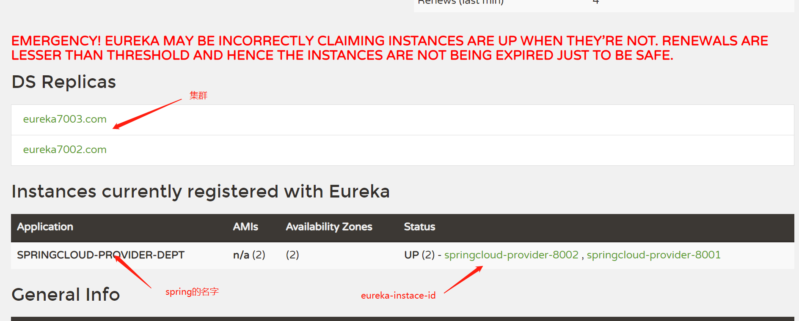
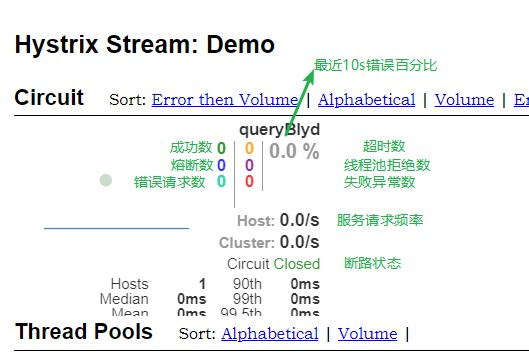

# SpringCloud

SpringBoot和SpringCloud关系：
- SpringBoot专注于快速方便的开发单个个体微服务
- SpringCloud是关注全局的微服务协调整理治理框架，它将SpringBoot开发的一个个单体微服务整合并管理起来，为各个微服务之间提供：配置管理，服务发现，断路由，路由，微代理，事件总线，全局锁，决策竞选，分布式会话等集成服务
- SpringBoot可以单独使用开发项目，但是SpringCloud不能单独使用，离不开SpringBoot，属于依赖关系
> 新建Maven项目，创建父项目依赖

```xml
    <dependencyManagement>
        <dependencies>
            <!--SpringCloud依赖-->
            <!-- https://mvnrepository.com/artifact/org.springframework.cloud/spring-cloud-dependencies -->
            <dependency>
                <groupId>org.springframework.cloud</groupId>
                <artifactId>spring-cloud-dependencies</artifactId>
                <version>Greenwich.SR1</version>
                <type>pom</type>
                <scope>import</scope>
            </dependency>
            <!--SpringBoot-->
            <!-- https://mvnrepository.com/artifact/org.springframework.boot/spring-boot -->
            <dependency>
                <groupId>org.springframework.boot</groupId>
                <artifactId>spring-boot-dependencies</artifactId>
                <version>2.1.4.RELEASE</version>
                <type>pom</type>
                <scope>import</scope>
            </dependency>
            <!--mysql-->
            <dependency>
                <groupId>mysql</groupId>
                <artifactId>mysql-connector-java</artifactId>
                <version>5.1.47</version>
            </dependency>
            <!--数据源-->
            <!-- https://mvnrepository.com/artifact/com.alibaba/druid -->
            <dependency>
                <groupId>com.alibaba</groupId>
                <artifactId>druid</artifactId>
                <version>1.1.0</version>
            </dependency>
            <!--SpringBoot mybatis启动器-->
            <!-- https://mvnrepository.com/artifact/org.mybatis.spring.boot/mybatis-spring-boot-starter -->
            <dependency>
                <groupId>org.mybatis.spring.boot</groupId>
                <artifactId>mybatis-spring-boot-starter</artifactId>
                <version>1.3.2</version>
            </dependency>
            <!--junit-->
            <!-- https://mvnrepository.com/artifact/junit/junit -->
            <dependency>
                <groupId>junit</groupId>
                <artifactId>junit</artifactId>
                <version>${junit.version}</version>
            </dependency>
            <!--lombok-->
            <!-- https://mvnrepository.com/artifact/org.projectlombok/lombok -->
            <dependency>
                <groupId>org.projectlombok</groupId>
                <artifactId>lombok</artifactId>
                <version>${lombok.version}</version>
            </dependency>
            <!--log4j-->
            <!-- https://mvnrepository.com/artifact/log4j/log4j -->
            <dependency>
                <groupId>log4j</groupId>
                <artifactId>log4j</artifactId>
                <version>${log4j.version}</version>
            </dependency>
            <!-- https://mvnrepository.com/artifact/ch.qos.logback/logback-core -->
            <dependency>
                <groupId>ch.qos.logback</groupId>
                <artifactId>logback-core</artifactId>
                <version>1.2.3</version>
            </dependency>
        </dependencies>
    </dependencyManagement>
```
> 创建实体类module
```java
@NoArgsConstructor
@Data
@Accessors(chain = true) //链式写法
/**
 * 链式写法
 * Dept dept = new Dept();
 * dept.setdeptno().setdeptName
 */
public class Dept {
    private Long deptno;
    private String deptName;
    //一个服务对应一个数据库
    private String deptSource;

    public Dept(String deptName){
        this.deptName = deptName;
    }
}
```
# Eureka
CAP理论：
- C（一致性）
- A（可用性）
- P（容错性）

Zookeeper保证的是CP;Eureka保证的是AP
==Eureka可以很好的应对因网络故障导致部分节点失去联系的情况，而不会像zookeeper那样使整个注册服务瘫痪==
调用微服务访问的方法：
- 微服务名字[Robbon]
- 接口和注解[feign]

> 创建eureka

- 导入eureka依赖
```xml
        <!-- https://mvnrepository.com/artifact/org.springframework.cloud/spring-cloud-starter-netflix-eureka-server -->
        <dependency>
            <groupId>org.springframework.cloud</groupId>
            <artifactId>spring-cloud-starter-netflix-eureka-server</artifactId>
        </dependency>
```
- euerka配置

```yml
server:
  port: 7001

# Eureka配置
eureka:
  instance:
    hostname: eureka7001.com #Eureka服务端实例的名称
  client:
    register-with-eureka: false #表示是否向eureka注册中心注册自己
    fetch-registry: false #如果为false,则表示自己为注册中心
    service-url:  #监控页面
      #单机:http://${eureka.instance.hostname}:${server.port}/eureka/
      #集群：
      defaultZone: http://eureka7002.com:7002/eureka/,http://eureka7003.com:7003/eureka/

```
- 主启动类添加注解

```java
@EnableEurekaServer //服务端的启动类，可以接收别人注册进来
```

> 创建提供者
- 依赖

```xml
    <dependencies>
        <!--要拿到实体类，需要配置api module-->
        <dependency>
            <groupId>com.xhh</groupId>
            <artifactId>springcloud-api</artifactId>
            <version>1.0-SNAPSHOT</version>
        </dependency>
        <dependency>
            <groupId>junit</groupId>
            <artifactId>junit</artifactId>
        </dependency>
        <dependency>
            <groupId>mysql</groupId>
            <artifactId>mysql-connector-java</artifactId>
        </dependency>
        <dependency>
            <groupId>com.alibaba</groupId>
            <artifactId>druid</artifactId>
        </dependency>
        <dependency>
            <groupId>ch.qos.logback</groupId>
            <artifactId>logback-core</artifactId>
        </dependency>
        <dependency>
            <groupId>org.mybatis.spring.boot</groupId>
            <artifactId>mybatis-spring-boot-starter</artifactId>
        </dependency>
        <dependency>
            <groupId>org.springframework.boot</groupId>
            <artifactId>spring-boot-test</artifactId>
        </dependency>
        <dependency>
            <groupId>org.springframework.boot</groupId>
            <artifactId>spring-boot-starter-web</artifactId>
        </dependency>
        <!--jetty:应用服务器-->
        <dependency>
            <groupId>org.springframework.boot</groupId>
            <artifactId>spring-boot-starter-jetty</artifactId>
        </dependency>
        <!--热部署-->
        <dependency>
            <groupId>org.springframework.boot</groupId>
            <artifactId>spring-boot-devtools</artifactId>
        </dependency>
        <dependency>
            <groupId>org.springframework.cloud</groupId>
            <artifactId>spring-cloud-starter-netflix-eureka-server</artifactId>
        </dependency>
        <!--完善监控信息-->
        <dependency>
            <groupId>org.springframework.boot</groupId>
            <artifactId>spring-boot-starter-actuator</artifactId>
        </dependency>
    </dependencies>
```
- dao层

```java
@Mapper
@Repository
public interface DeptDao {
    boolean addDept(Dept dept);
    Dept queryBIyd(Long id);
    List<Dept> queryAll();
}
```

- service层
- controller层

```java
@RestController
public class DeptController {
    @Autowired
    private DeptService deptService;

    @PostMapping("/dept/add")
    public boolean addDept(Dept dept){
        return deptService.addDept(dept);
    }

    @GetMapping("/dept/{id}")
    public Dept queryBIyd(@PathVariable Long id){
        return deptService.queryBIyd(id);
    }

    @RequestMapping("/dept/queryAll")
    public List<Dept> queryAll() {
        return deptService.queryAll();
    }
}
```
- DeptMapper.xml
- applicaiton.yml

``` yml
server:
  port: 8001

#mybatis
mybatis:
  type-aliases-package: com.xhh.springcloud.pojo
  mapper-locations: classpath:mybatis/mapper/*.xml

#spring
spring:
  application:
    name: springcloud-provider-dept
  datasource:
    type: com.alibaba.druid.pool.DruidDataSource
    driver-class-name: com.mysql.jdbc.Driver
    url: jdbc:mysql://localhost:3306/db_01?useUnicode=true&characterEncoding=utf-8
    username: root
    password: xhh1999.02.10

#注册到Eureka中
eureka:
  client:
    service-url:
      defaultZone: http://eureka7001.com:7001/eureka/,http://eureka7002.com:7002/eureka/,http://eureka7003.com:7003/eureka/
  instance:
    instance-id: springcloud-provider-8001
#info配置
info:
  app.name: xhh
  company.name : www.baidu.com
```
- 主配置类添加注解

```java
@EnableEurekaClient //向eureka注册扫描
```

# Ribbon负载均衡
SpringCloudRibbon是基于NetFixRibbon实现的一套==客户端负载均衡的工具==
不用导入依赖,`spring-cloud-starter-netflix-hystrix`包含ribbon相关依赖
> 创建多个提供者,多个数据库，与提供者对应


> 创建消费者

- 创建config类

```java
@Configuration
public class ConfigBean {

    //配置负载均衡
    @Bean
    @LoadBalanced   //Ribbon
    public RestTemplate restTemplate(){
        return new RestTemplate();
    }
}
```
- controller层

```java
@Controller
@ResponseBody
public class DeptConsumerController {

    //通过访问http得到数据
    @Autowired
    private RestTemplate restTemplate;//提供多种便捷访问远程http服务的方法，简单的restful模板

//    private static final String REST_URL_PREFIX = "http://localhost:8001";
    //Ribbon通过
private static final String REST_URL_PREFIX = "http://SPRINGCLOUD-PROVIDER-DEPT";
    @RequestMapping("/dept/consumer/add")
    public boolean addDept(Dept dept){
        return restTemplate.postForObject(REST_URL_PREFIX+"/dept/add",dept,boolean.class);
    }

    @RequestMapping("/dept/consumer/{id}")
    public Dept queryBIyd(@PathVariable("id") Long id){
        return restTemplate.getForObject(REST_URL_PREFIX+"/get/"+id,Dept.class);
    }

    @RequestMapping("/dept/consumer/queryAll")
    public List<Dept> queryAll() {
        return restTemplate.getForObject(REST_URL_PREFIX+"/dept/queryAll",List.class);
    }
}
```
- application.yml

```yml
server:
  port: 8083


#eureka配置
eureka:
  client:
    register-with-eureka: false #不向eureka注册自己
    service-url:
      defaultZone: http://eureka7001.com:7001/eureka/,http://eureka7002.com:7002/eureka/,http://eureka7003.com:7003/eureka/

```
# Fegin负载均衡
==在Feigin的实现下，我们只需要创建一个接口并使用注解的方式来配置它（类似于dao接口的@Mapper注解，现在是一个微服务接口上标注一个Feign注解即可）==

- 导入依赖

```xml
        <dependency>
            <groupId>org.springframework.cloud</groupId>
            <artifactId>spring-cloud-starter-openfeign</artifactId>
        </dependency>
```
- 在实体类module中添加service层,service映射链接和提供者controller映射链接相同

```java
@FeignClient(value = "SPRINGCLOUD-PROVIDER-DEPT")
public interface DeptClientService {

    @RequestMapping("/dept/add")
    boolean addDept(Dept dept);

    @RequestMapping("/dept/{id}")
    Dept queryBIyd(@PathVariable("id") Long id);

    @RequestMapping("/dept/queryAll")
    List<Dept> queryAll();
}
```
- 消费者controller层

```java
@Controller
@ResponseBody
public class DeptConsumerController {

    @Autowired(required = false)
    private DeptClientService deptClientService;

    @RequestMapping("/dept/consumer/add")
    public boolean addDept(Dept dept){
        return this.deptClientService.addDept(dept);
    }

    @RequestMapping("/dept/consumer/{id}")
    public Dept queryBIyd(@PathVariable("id") Long id){
        return this.deptClientService.queryBIyd(id);
    }

    @RequestMapping("/dept/consumer/queryAll")
    public List<Dept> queryAll() {
        return this.deptClientService.queryAll();
    }
}
```
- 主配置添加注解

```java
@EnableFeignClients(basePackages = {"com.xhh.springcloud"})
```
# Hystrix
- Hystrix是一个用于处理分布式系统的延迟和容错的开源库，在分布式系统里，许多依赖不可避免的会调用失败，比如超时，异常等，Hystrix能够保证在一个依赖出问题的情况下，不会导致整体服务失败，避免级联故障，以提高分布式系统的弹性。
- “短路由”本身是一种开关设置，当某个服务单元发生故障之后，通过断路器的故障监控（类似熔断保险丝），**向调用方法返回一个服务预期的，可处理的备选响应（fallback），而不是长时间的等待或者抛出调用方法无法处理的异常，这样就保证了服务调用方的线程不会被长时间不必要的占用**，从而避免了故障在分布式系统中的蔓延，乃至雪崩

## 服务熔断 
导入依赖
```xml
        <dependency>
            <groupId>org.springframework.cloud</groupId>
            <artifactId>spring-cloud-starter-netflix-hystrix</artifactId>
        </dependency>
```
- 熔断机制是对应雪崩效应的一种微服务链路保护机制

- 创建springcloud-provider-dept-hystrix-8001module
- 修改controller类

```java
@RestController
public class DeptController {
    @Autowired
    private DeptService deptService;

    @GetMapping("/dept/{id}")
    @HystrixCommand(fallbackMethod = "hystrixQueryBIyd")
    public Dept queryBIyd(@PathVariable Long id){
        Dept dept = deptService.queryBIyd(id);

        if(dept == null){
            throw new RuntimeException("id==>"+id+"不存在该id");
        }
        return dept;

    }

    //备选方法
    public Dept hystrixQueryBIyd(@PathVariable("id") Long id) {
        return new Dept().setDeptno(id)
                .setDeptName("id->"+id+"没有对应的信息,null")
                .setDeptSource("no this database in MySql");
    }


}
```
- 主启动类添加注解

```java
//添加对熔断的支持
//@EnableCircuitBreaker
@EnableHystrix
```
## 服务降级
- 在springcloud-api中service层添加`FallbackFactory`实现类DeptClientServiceFallbckFactory,重写create方法

```java
@Component
public class DeptClientServiceFallbackFactory implements FallbackFactory {
    public DeptClientService create(Throwable throwable) {
        return new DeptClientService() {
            public boolean addDept(Dept dept) {
                return false;
            }

            public Dept queryBIyd(Long id) {
                return new Dept()
                        .setDeptno(id)
                        .setDeptName("id==>"+id+"没有对应的信息，客户端提供了降级的信息，整个服务现在被关闭")
                        .setDeptSource("没有数据");
            }

            public List<Dept> queryAll() {
                return null;
            }
        };
    }
}
```
- 在DeptClientService接口中添加注解

```java
@FeignClient(value = "SPRINGCLOUD-PROVIDER-DEPT",fallbackFactory = DeptClientServiceFallbackFactory.class)
```
- 在客户端applicaiton.yml添加配置

```yml
#开启降级feign,hystrix
feign:
  hystrix:
    enabled: true
```

## 区别
> 服务熔断

服务端；某个服务超时或者异常，引起熔断

> 服务降级

客户端；从整体网站请求负载考虑，当某个服务熔断或者关闭之后，服务将不再调用，此时在客户端我们可以准备一个FallbackFactory，返回一个默认的值，整体的服务水平下降
## Dashboard流监控
- 创建`springcloud-consumer-hystrix-dashboard`
- 导入dashboard依赖

```xml
        <dependency>
            <groupId>org.springframework.cloud</groupId>
            <artifactId>spring-cloud-starter-netflix-hystrix-dashboard</artifactId>
        </dependency>
```
- application.yml配置端口号
- 编写主配置类，添加dashboard注解
  
```java
@SpringBootApplication
//开启dashboard
@EnableHystrixDashboard
public class DeptConsumerDashboard_9001 {
    public static void main(String[] args) {
        SpringApplication.run(DeptConsumerDashboard_9001.class,args);
    }
}
```
- 在`sringcloud-provider-dept-hystrix-8001`配置类中添加servlet

```java
    //增加一个servlet
    @Bean
    public ServletRegistrationBean hystrixMetricsStreamServlet(){
        ServletRegistrationBean registrationBean = new ServletRegistrationBean(new HystrixMetricsStreamServlet());
        registrationBean.addUrlMappings("/actuator/hystrix.stream");
        return  registrationBean;
    }
```

# Zuul路由网关
Zuul包含了对请求的路由和过滤两个主要的功能：其中路由功能负责将外部请求转发到具体的微服务上，是实现外部访问同一入口的基础，而过滤器功能则负责对请求的处理过程进行干预，是实现请求校验，服务聚合等功能的基础。Zuul和Eureka进行整合，将Zuul自身注册成为Eureka服务治理下的应用，同时从Eureka中获得其他微服务的消息，即以后的访问微服务都是通过Zuul跳转后获得
- 创建`springcloud-zuul-9527`项目

```xml
        <dependency>
            <groupId>org.springframework.cloud</groupId>
            <artifactId>spring-cloud-starter-netflix-zuul</artifactId>
        </dependency>
```
- 创建主启动类，添加zuul注解

```java
@EnableZuulProxy
```
- 配置applicaion.yml

```yml
server:
  port: 9527

spring:
  application:
    name: springcloud-zuul

eureka:
  client:
    service-url:
      defaultZone: http://eureka7001.com:7001/eureka/,http://eureka7002.com:7002/eureka/,http://eureka7003.com:7003/eureka/
  instance:
    instance-id: zuul9527.com

info:
  app.name: springcloudzuul
  company.name: xhh

zuul:
  routes:
    mydept.serviceId: springcloud-provider-dept
    mydept.path: /mydept/**
  ignored-services: "*"   #springcloud-provider-dept 隐藏，不能使用该路径访问 *隐藏全部
  prefix: /xhh
```
# SpringCloud config分布式配置
微服务意味着要将单体应用中的业务拆分成一个个子服务，每个服务的粒度相对较小，因此系统中会出现大量的服务，由于每个服务需要配置文件，所以一套集中，动态的配置管理设施是必不可少的
> 服务端

- 新建Module`springcloud-config-server-3344`

```xml
        <dependency>
            <groupId>org.springframework.cloud</groupId>
            <artifactId>spring-cloud-config-server</artifactId>
        </dependency>
```

- application.yml文件中添加git相关配置

```yml
server:
  port: 3344
spring:
  application:
    name: springcloud-config-server
    #连接远程仓库
  cloud:
    config:
      server:
        git:
          uri: https://gitee.com/cnuto/springcloud-config.git
          username: 13767152962
          password: xhh1999.02.10
```
- 主启动类添加注解

```java
@EnableConfigServer
```
> 客户端

- 新建module，导入依赖

```xml
        <dependency>
            <groupId>org.springframework.cloud</groupId>
            <artifactId>spring-cloud-config-client</artifactId>
        </dependency>
```
- 创建bootstrap.yml和application.yml文件
  - bootstrap.yml

```yml
#系统级别的配置
spring:
  cloud:
    config:
      uri: http://localhost:3344
      name: config-client #需要在git上读取的资源文件名
      profile: dev
      label: master
```
  - application.yml

```yml
#用户级别的配置
spring:
  application:
    name: springcloud-config-client-3355
```
- 编写controller测试

```java
@RestController
public class ConfigClientController {
    @Value("${spring.application.name}")
    private String applicationName;

    @Value("${eureka.client.service-url.defaultZone}")
    private String eurekaServer;

    @Value("${server.port}")
    private String ports;

    @RequestMapping("/config")
    public String getConfig(){
        return "application"+applicationName+
                "eurekaServer"+eurekaServer+
                "ports"+ports;
    }
}
```
==gitee上传文件application.yml和config-client.yml文件==
```yml
spring:
  profiles:
    active: dev

---

server:
  port: 8201
#spring
spring:
  profiles: dev  
  application:
    name: springcloud-provider-dept

#注册到Eureka中
eureka:
  client:
    service-url:
      defaultZone: http://eureka7001.com:7001/eureka/,http://eureka7002.com:7002/eureka/,http://eureka7003.com:7003/eureka/
      
      
---

server:
  port: 8202
#spring
spring:
  profiles: test  
  application:
    name: springcloud-provider-dept

#注册到Eureka中
eureka:
  client:
    service-url:
      defaultZone: http://eureka7001.com:7001/eureka/,http://eureka7002.com:7002/eureka/,http://eureka7003.com:7003/eureka/
```